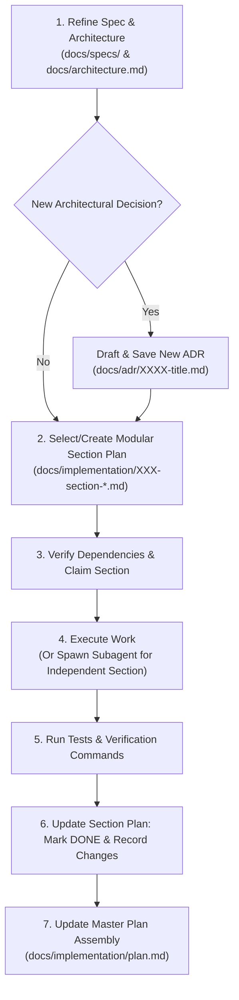

# Modular Implementation Plan & Spec-First Workflow Skill

This skill guides agents and subagents through the mandatory two-phase workflow for all feature development, refactoring, and infrastructure tasks.

---

## Workflow Overview



---

## Step-by-Step Procedure

### Phase 1: Specification & ADR Refinement
1. Read reference specs: [`docs/specs/personal-rag-spec.md`](file:///d:/src/tt-agents-agentic-RAG.gh.public.git/docs/specs/personal-rag-spec.md) and [`docs/architecture.md`](file:///d:/src/tt-agents-agentic-RAG.gh.public.git/docs/architecture.md).
2. Verify implementation feasibility against current codebase.
3. If new architectural trade-offs, ingress changes, or tech stack choices are required, create a new ADR in [`docs/adr/`](file:///d:/src/tt-agents-agentic-RAG.gh.public.git/docs/adr/).
4. Apply spec refinements into the target section plan in [`docs/implementation/`](file:///d:/src/tt-agents-agentic-RAG.gh.public.git/docs/implementation/).

### Phase 2: Modular Implementation Plan Execution

#### 1. Checking Active Section
- Locate the section file in `docs/implementation/XXX-section-<name>.md` corresponding to your task.
- Check section prerequisites and dependency status.
- Ensure the section is decoupled from concurrently running tasks.

#### 2. Subagent Task Delegation (For Independent Sections)
- Independent sections can be delegated to subagents using `invoke_subagent`.
- Provide the subagent with the exact path to its assigned section file (`docs/implementation/XXX-section-<name>.md`).
- Direct the subagent to read the section file, perform the implementation, run verification tests, update the section file to `[DONE]`, and report back.

#### 3. Task Execution & Verification
- Execute code changes.
- Run tests and linters:
  ```powershell
  & '.venv\Scripts\python.exe' -m pytest -q
  & '.venv\Scripts\python.exe' -m ruff check src tests evals
  ```

#### 4. Section Status Update & Documentation
- Edit the section file `docs/implementation/XXX-section-<name>.md`:
  - Change status header to `Status: DONE`.
  - Mark completed checklists with `[x] [DONE]`.
  - Add a **Changes Implemented** section documenting updated files and verification logs.
  - If follow-up work or technical debt was discovered, create a new section file (e.g. `XXX-section-<follow-up>.md`).

#### 5. Assembly in Master Plan
- Update [`docs/implementation/plan.md`](file:///d:/src/tt-agents-agentic-RAG.gh.public.git/docs/implementation/plan.md) master table with updated section statuses and newly created follow-up section links.
