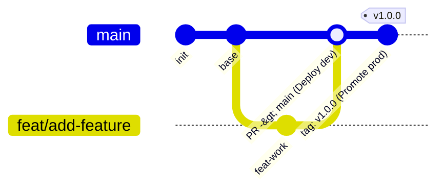

# Repository Development Standards & Security Rules

> **CRITICAL MANDATE: ZERO IDENTITY OR CREDENTIAL LEAKS**
> This repository is **100% PUBLIC**. Under NO circumstances may any personal identity, account email, real GCP Project ID, billing info, private key, token, or secret ever be written to files, committed to git, or included in pull requests.

---

## 1. Absolute Redaction & Documentation Hygiene

1. **Never Include Absolute Paths in Documentation**:
   - Always use repository-relative paths (e.g., `scripts/smoke.sh`, `deployment/gcp/`, `src/personal_rag/`).
   - Never write machine-specific or user-specific absolute paths (e.g., `C:\Users\...`, `D:\src\...`, `/home/username/...`) in documentation, configs, or rules.

2. **GCP Project Identifiers**:
   - Never write real GCP project IDs (e.g., `tt-rag-...`).
   - Always use generic placeholders: `your-gcp-project-id`, `PROJECT_ID`, or `${var.project_id}`.

3. **Personal Identifiers & Emails**:
   - Never write personal or organizational emails.
   - Always use generic placeholders: `user:your-email@example.com` or `your-email@example.com`.

4. **Service Account Names & WIF Providers**:
   - Never commit specific WIF pool IDs, provider resource paths, or organization numbers.
   - Use `${var.wif_provider}` or `projects/1234567890/locations/global/workloadIdentityPools/...` placeholders.

5. **Secrets & Credentials**:
   - Zero hardcoded API keys (`AIza...`, `ghp_...`, `gho_...`, `ya29...`, `Bearer ...`).
   - Zero hardcoded passwords, tokens, certificates, or private keys.

---

## 2. Git Branching Model & Release Workflow (Trunk-Based)



### Branch & Environment Architecture
- **`main`**: The single trunk branch and source of truth. Always deployable and tested.
- **`feature/*` / `fix/*` / `chore/*`**: Short-lived task or bug fix branches created off `main`.
- **Environment Parity (`dev` vs. `prod`)**:
  - Codebase is identical across both environments (12-Factor principle).
  - Environments differ **only** by configuration and credentials stored in environment variables, Secret Manager, or GitHub Environment secrets.
  - **CI Validation**: Runs tests, linting, evaluations, and security scans on push to `main`.
  - **Deployments**: Triggered explicitly via Git release tags (e.g., `v1.0.0`) or manual workflow dispatch. Untagged commits do not deploy automatically.

### Strict Workflow Rules
1. **Branch Off `main`**: Always create new feature, fix, or chore branches off the latest `main`.
2. **Pull Requests Only**: All changes merge into `main` strictly via Pull Request.
3. **No Direct Pushes**: Direct pushes to `main` are strictly forbidden.
4. **Clean History**: Ensure branches are rebased or synced with `main` before opening a PR.

---

## 3. Commit Conventions & AI Attribution

1. **Conventional Commits**: Format commit titles as `<type>(<scope>): <short description>`.
   - Examples: `feat(api): add healthcheck endpoint`, `fix(infra): update cloud sql edition`
2. **AI Co-Author Attribution**:
   - When an AI agent assists with or performs a commit, append the acting agent's trailer at the end of the commit message:
     - **Gemini / Antigravity**: `Co-authored-by: Gemini gemini@google.com`
     - **Claude Code**: `Co-authored-by: Claude claude@anthropic.com`
     - **Codex / OpenAI**: `Co-authored-by: Codex codex@openai.com`
   - Only attribute the specific agent(s) that actively authored or assisted with the changes in that commit.

---

## 4. Execution Environments & Virtual Environment Isolation

> **CRITICAL**: Python virtual environments (`.venv`) and compiled binaries are platform-dependent and **must not be shared or cross-executed** between Windows and WSL. Each environment operates in its own local clone/directory with an isolated `.venv`.

| Environment | Primary Scope & Tooling | Virtual Env |
|---|---|---|
| **Windows** | Windows PowerShell, local code editing, Windows-native `uv` & Python | Windows-isolated `.venv` |
| **WSL (Linux)** | `gcloud` CLI, OpenTofu (`tofu`), cloud provisioning, Linux-native `uv` & Python | Linux-isolated `.venv` |

### Command Execution Routing
- Run PowerShell / Windows commands inside the Windows workspace root.
- Run `gcloud` / OpenTofu commands inside the WSL Linux workspace root.
- Never invoke Python scripts across environment boundaries using the wrong OS binary.

---

## 5. File & Commit Hygiene

1. **Gitignore Strict Enforcement**:
   - Never remove or bypass `.gitignore` rules for `.env`, `*.tfvars`, `*.tfstate`, `*credentials*.json`, `*sa_key*.json`, `*.pem`, `*.key`.
   - Always verify files being committed with `git status` before committing.

2. **Examples Only**:
   - Only check in sanitized `.env.example` and `terraform.tfvars.example`.
   - Never stage or commit `.env` or `deployment/gcp/terraform.tfvars`.

3. **Pre-Commit Verification**:
   - Run a sensitive pattern scan before pushing or proposing changes.
   - Any accidental commit of private details must be immediately wiped from history before pushing.

---

## 6. GitHub Actions & CI Policy

1. **Secrets vs Variables**:
   - All environment-specific identifiers (`GCP_PROJECT_ID`, `GCP_WIF_PROVIDER`, etc.) must be referenced as GitHub **Secrets** (`${{ secrets.GCP_PROJECT_ID }}`) or masked dynamically so they are never printed to public build logs.
2. **Pull Requests & Deployments**:
   - All PRs must target `main` from short-lived feature branches.
   - Direct pushes to `main` are strictly forbidden.
   - Tagged releases (e.g., `v*.*.*`) or promotion workflows trigger production deployments.

---

## 7. Architecture Documentation & C4 Modeling Standards

1. **Mandatory C4 Architectural Modeling**:
   - All architectural specifications, design reviews, and structural documentation across `docs/` MUST follow the **C4 Model** hierarchy:
     - **Level 1: System Context** (`C4_Context`): Defines high-level actors, external systems, identity boundaries, and overall system boundaries.
     - **Level 2: Containers** (`C4_Container`): Depicts deployable and runnable units (applications, databases, microservices, workers) and inter-container protocols.
     - **Level 3: Components** (`C4_Component`): Decomposes individual containers into internal modular blocks, adapters, controllers, and services.
     - **Level 4: Code / Data** (`C4_Component` / ERDs): Outlines entity-relationship models, schemas, and state machines (kept lightweight or generated).
     - **Supplementary Views**: Deployment diagrams (`C4_Deployment`) mapping containers to physical/cloud infrastructure, and Dynamic diagrams (`C4_Dynamic`) for runtime/use-case sequence flows.

2. **C4-PlantUML as Primary Architecture-as-Code Standard**:
   - Use standard **C4-PlantUML** include libraries:
     - Context: `!include <C4/C4_Context>`
     - Containers: `!include <C4/C4_Container>`
     - Components: `!include <C4/C4_Component>`
     - Deployment: `!include <C4/C4_Deployment>`
     - Dynamic: `!include <C4/C4_Dynamic>`
   - Every diagram element must have an explicit name, type/role, technology stack (where applicable), and description.
   - Every relationship arrow (`Rel`, `Rel_D`, `Rel_R`, etc.) MUST specify an action verb and communication protocol (e.g., `Rel(user, api, "Queries evidence", "HTTPS / JSON")`).

3. **Inline Diagrams Mandate (Diagrams-as-Code)**:
   - All architectural diagrams MUST be embedded **inline** as code blocks within Markdown files (using ````plantuml ... ```` or ````mermaid ... ```` for simple flowcharts/state machines).
   - Never commit binary, rasterized image files (PNG, JPEG, etc.) for architectural diagrams; diagrams must remain version-controlled, diffable, and editable as code in Git.
   - Follow zero-leak and redaction rules inside diagram definitions: never include real account emails, real GCP project IDs, or machine-specific absolute file paths in diagram nodes or labels.

