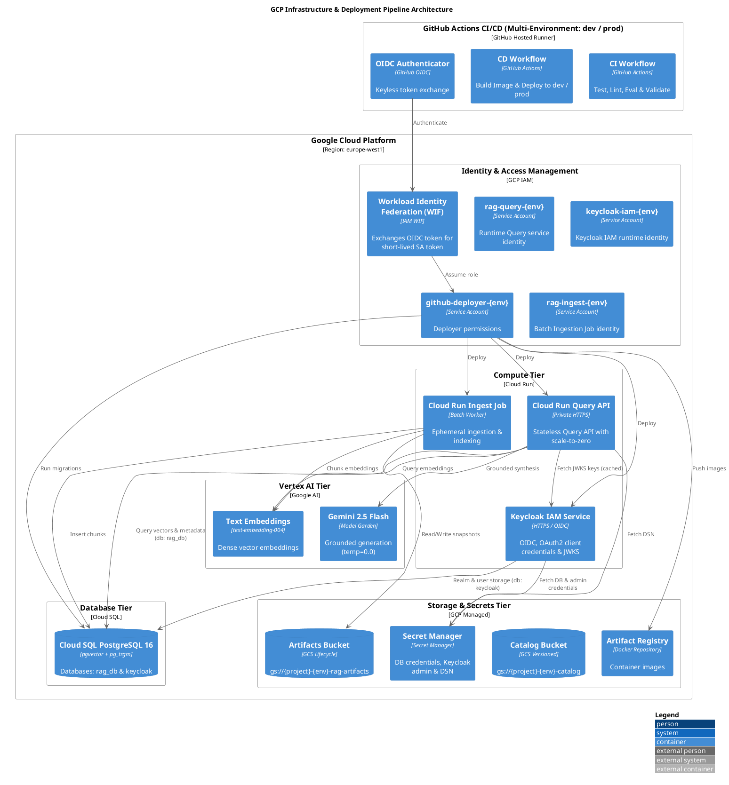

# Deployment & Cloud Infrastructure Guide

This directory contains the Infrastructure-as-Code (IaC) definitions, deployment blueprints, and operational procedures for deploying the **Personal RAG Platform** to Google Cloud Platform (GCP).

> [!NOTE]
> **Open Source / Forking Notice**: This repository is completely generic and contains **no hardcoded credentials, personal project IDs, or private secrets**. Anyone can fork this repository, configure their own GCP project and GitHub Actions variables, and deploy their own independent RAG instance across `dev` and `prod` environments.

---

## 1. Cloud Architecture Overview



---

## 2. Multi-Environment Architecture (`dev` vs `prod`)

All GCP resources are parameterised with `var.environment` (`dev`, `staging`, `prod`):

| Resource Type | Resource Name Pattern | Purpose / Isolation |
|---|---|---|
| **Cloud Run Service** | `${var.environment}-tt-rag-parts` | Independent query APIs per environment |
| **Cloud Run Job** | `${var.environment}-personal-rag-ingest` | Independent batch ingestion per environment |
| **Cloud SQL Instance** | `${var.environment}-rag-db-<suffix>` | Complete database isolation with `pgvector` |
| **Database & User** | `${var.environment}_personal_rag` | Environment-specific database schemas |
| **Cloud Storage** | `${var.project_id}-${var.environment}-rag-artifacts` | Isolated versioned artifact buckets |
| **Secret Manager** | `${var.environment}-rag-database-url` | Isolated encrypted database credentials |
| **Service Accounts** | `rag-query-${var.environment}`, `rag-ingest-${var.environment}` | Independent runtime IAM identities |

---

## 3. Infrastructure as Code Structure (`deployment/gcp/`)

The infrastructure is written for **OpenTofu / Terraform** ($\ge 1.8$) using the Google Provider ($\sim> 7.0$):

| File | Purpose | Managed Resources |
|---|---|---|
| [`variables.tf`](gcp/variables.tf) | Input variable declarations | `project_id`, `region`, `environment`, `image`, `invoker`, `github_repository`, `db_tier`, etc. |
| [`main.tf`](gcp/main.tf) | Core provider & platform APIs | Enables 12 GCP APIs (`run`, `sqladmin`, `aiplatform`, `secretmanager`, `storage`, etc.) & Artifact Registry Docker repository. |
| [`storage.tf`](gcp/storage.tf) | Cloud Storage Buckets | Versioned catalog bucket and generic artifacts bucket (raw documents, normalized chunks, manifests) with retention rules. |
| [`sql.tf`](gcp/sql.tf) | Cloud SQL with `pgvector` | PostgreSQL 16 instance with `cloudsql.enable_pgvector = "on"`, automated backups, database, and application user. |
| [`secrets.tf`](gcp/secrets.tf) | Secret Manager | Secure storage of generated database passwords and PostgreSQL connection URLs. |
| [`iam.tf`](gcp/iam.tf) | Least-Privilege IAM | Dedicated Service Accounts for Query Runtime (`roles/aiplatform.user`, `roles/cloudsql.client`), Ingestion Job, and CI/CD Deployer. |
| [`wif.tf`](gcp/wif.tf) | Workload Identity Federation | Pool & Provider for GitHub Actions OIDC authentication, scoped strictly to the authorized repository. |
| [`services.tf`](gcp/services.tf) | Cloud Run Services & Jobs | Private FastAPI Query API service (with Cloud SQL volume mount, probes, and env vars) and batch Ingestion Job. |
| [`outputs.tf`](gcp/outputs.tf) | Terraform Outputs | Query Service URL, catalog GCS URI, artifacts bucket, Cloud SQL instance connection name, and WIF provider strings. |
| [`terraform.tfvars.example`](gcp/terraform.tfvars.example) | Example configuration template | Example variable values for local deployments. |

---

## 4. Fork & Deploy Guide for New Users

Follow these steps to deploy your own instance of the RAG platform:

### Step 1: Create a GCP Project & Enable Billing
1. Create a Google Cloud Project (e.g. `my-rag-project-dev` and `my-rag-project-prod`).
2. Make sure billing is enabled on the project.

### Step 2: Configure GitHub Repository Variables & Secrets
In your forked GitHub repository, navigate to **Settings $\rightarrow$ Environments** and create `dev` and `prod` environments (or set repository-level variables under **Settings $\rightarrow$ Secrets and variables $\rightarrow$ Actions**):

| Name | Type | Value / Description |
|---|---|---|
| `GCP_PROJECT_ID` | **Variable** | Your GCP Project ID (e.g. `my-rag-project`) |
| `GCP_REGION` | **Variable** | Your preferred region (e.g. `europe-west1` or `us-central1`) |
| `GCP_INVOKER` | **Variable** | *(Optional)* IAM principal allowed to invoke Cloud Run (e.g. `user:you@example.com` or `allAuthenticatedUsers`) |
| `GCP_WIF_PROVIDER` | **Variable** | *(Set after initial IaC apply)* WIF provider resource name from `tofu output wif_provider` |
| `GCP_WIF_SERVICE_ACCOUNT` | **Variable** | *(Set after initial IaC apply)* Deployer service account email from `tofu output wif_service_account` |

---

## 5. Local and Manual Deployment Instructions

### Prerequisites
- Google Cloud SDK (`gcloud`) installed and logged in: `gcloud auth login`
- OpenTofu (`tofu`) or Terraform (`terraform`) $\ge 1.8$ installed.
- Docker or GCP Cloud Build enabled.

### Step-by-Step CLI Deployment

#### 1. Set Local Environment Variables
```bash
export PROJECT_ID="your-gcp-project-id"
export REGION="europe-west1"
export ENVIRONMENT="dev"
export IMAGE="${REGION}-docker.pkg.dev/${PROJECT_ID}/tt-rag-parts/api:$(git rev-parse --short HEAD)"
export INVOKER="user:your-email@example.com"
export GITHUB_REPO="your-username/your-forked-repo"
```

#### 2. Build and Push the Container Image
```bash
# Using Google Cloud Build:
gcloud builds submit --project="${PROJECT_ID}" --tag="${IMAGE}" .

# OR using local Docker:
gcloud auth configure-docker "${REGION}-docker.pkg.dev" --quiet
docker build -t "${IMAGE}" .
docker push "${IMAGE}"
```

#### 3. Initialize and Apply Infrastructure
```bash
cd deployment/gcp

# Copy example variables
cp terraform.tfvars.example terraform.tfvars
# Edit terraform.tfvars with your values

# Initialize providers
tofu init

# Plan and review changes
tofu plan \
  -var="project_id=${PROJECT_ID}" \
  -var="region=${REGION}" \
  -var="environment=${ENVIRONMENT}" \
  -var="image=${IMAGE}" \
  -var="invoker=${INVOKER}" \
  -var="github_repository=${GITHUB_REPO}"

# Apply deployment
tofu apply -auto-approve \
  -var="project_id=${PROJECT_ID}" \
  -var="region=${REGION}" \
  -var="environment=${ENVIRONMENT}" \
  -var="image=${IMAGE}" \
  -var="invoker=${INVOKER}" \
  -var="github_repository=${GITHUB_REPO}"
```

#### 4. Retrieve Outputs and Verify Health
```bash
# Get the deployed Cloud Run service URL
SERVICE_URL=$(tofu output -raw service_url)
echo "Service is live at: ${SERVICE_URL}"

# Obtain an identity token and test health
TOKEN=$(gcloud auth print-identity-token)
curl -H "Authorization: Bearer ${TOKEN}" "${SERVICE_URL}/health"
```

---

## 6. Rollback & Disaster Recovery

- **Service Rollback**: Cloud Run revisions are immutable. To roll back an erroneous service deployment:
  ```bash
  gcloud run services update-traffic dev-tt-rag-parts \
    --region=europe-west1 \
    --to-revisions=PREVIOUS_REVISION_NAME=100
  ```
- **Index Rollback**: Ingestion runs produce candidate indexes. The active index pointer in Cloud SQL PostgreSQL is updated atomically only after passing evaluation gates. Rolling back an index is an atomic database pointer update without downtime or data restoration.
- **Storage Rollback**: Both GCS buckets maintain object versioning. Deleted or overwritten files can be restored directly via GCS object generation IDs.
