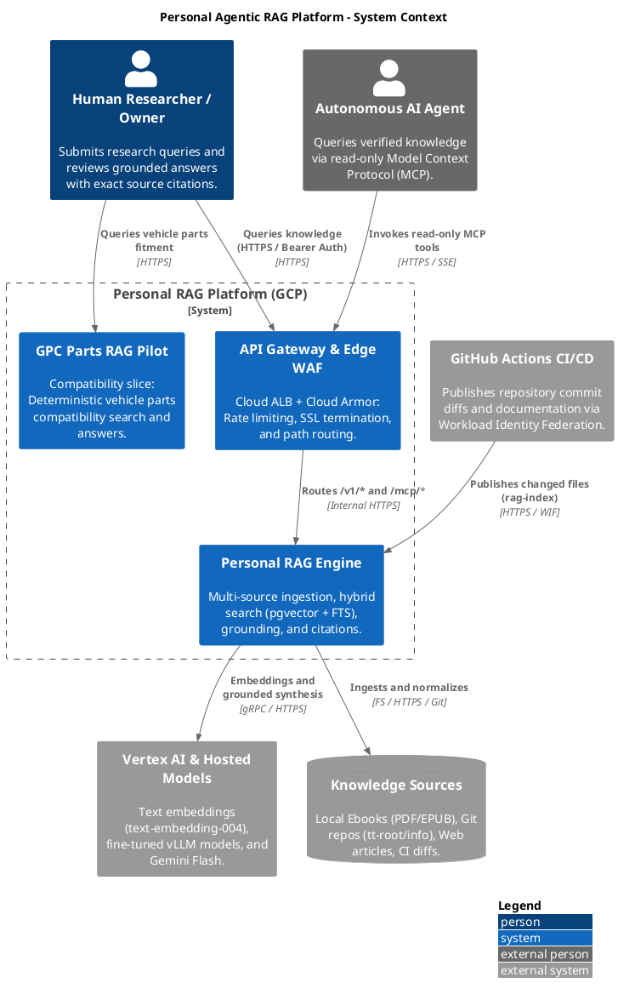
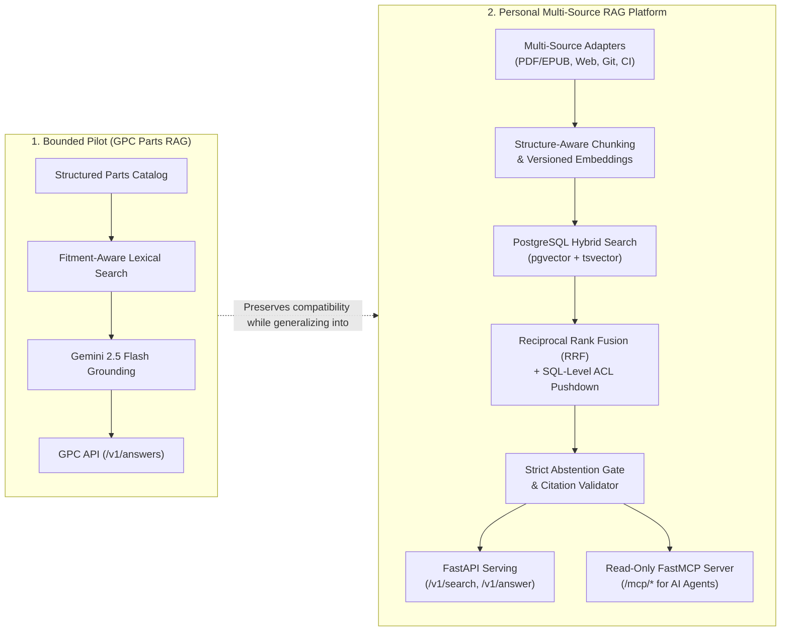
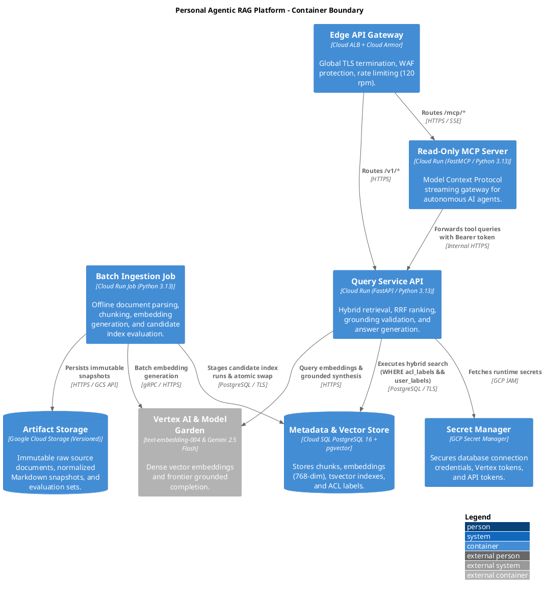

# Architecture Overview: Personal Agentic RAG Platform

> **Platform**: Personal Agentic Retrieval-Augmented Generation (RAG) Platform & GPC Pilot  
> **Status**: Living Architectural Baseline  
> **Scope**: High-level platform architecture, subsystem boundaries, data lifecycle, and documentation atlas.

---

## 1. Executive Summary & Purpose

The **Personal Agentic RAG Platform** is a production-grade, multi-source, privacy-first Retrieval-Augmented Generation (RAG) platform deployed on Google Cloud Platform (GCP). It transforms heterogeneous, unstructured, and semi-structured knowledge into versioned, grounded, and policy-filtered retrieval artifacts.

The platform serves two primary user personas:
1. **Human Researchers & Operators**: Interacting via HTTPS APIs, Web UIs, or CLI tools for multi-source research queries with verifiable citations.
2. **Autonomous AI Agents** (e.g., Antigravity, Claude Code, Cursor): Accessing verified knowledge strictly via a read-only **Model Context Protocol (MCP)** interface without write or mutation permissions.



---

## 2. Architectural Evolution: Pilot to Multi-Source Platform

The repository implements a staged architectural model:



1. **GPC Parts RAG Pilot**: The initial, deployable vertical slice focusing on vehicle parts fitment, strict lexical matching, and closed-loop grounding.
2. **Personal Multi-Source Platform**: The generalized platform introducing pluggable source adapters, hybrid vector retrieval, SQL-level ACL filtering, offline candidate index gates, and agent boundaries.

---

## 3. High-Level Container Architecture

The system is deployed on GCP serverless and managed infrastructure to maintain a **scale-to-zero** cost profile when idle while delivering sub-second hybrid retrieval.



---

## 4. Core Subsystems & Operational Flow

### 4.1 Ingestion & Processing Pipeline
- **Source Adapters**: Uniform [`SourceAdapter`](file:///d:/src/tt-agents-agentic-RAG.gh.public.git/src/personal_rag/sources/base.py) protocol ingesting Local Filesystem (`PDF`, `EPUB`, `MD`), Git repositories (`tt-root/info`), Approved Web pages (with SSRF guard and DNS pinning), and CI/CD repository diffs.
- **Normalization & Structure-Aware Chunking**: Markdown-aware and code-aware chunkers splitting on natural section headings and symbol boundaries (target 400–800 tokens, 10–15% overlap) without cross-heading merging.
- **Deduplication & Idempotency**: SHA-256 content hashing at document and chunk levels prevents redundant embeddings or writes.
- **Candidate Indexing & Atomic Swap**: Ingestion builds an isolated candidate run (`CANDIDATE`). Once golden retrieval evaluation gates pass, an atomic pointer swap promotes the run to `ACTIVE`.

### 4.2 Query Engine & Retrieval Pipeline
- **Authentication**: Pluggable authentication supporting single-user Bearer token validation (MVP via Secret Manager) and decoupled multi-tenant Keycloak JWKS verification (Target).
- **Hybrid Retrieval**: Parallel PostgreSQL full-text search (`tsvector` with `ts_rank`) and dense vector similarity (`pgvector` cosine distance).
- **SQL-Level Policy Pushdown**: User ACL labels (`user_labels`) are evaluated directly in SQL (`WHERE acl_labels && :user_labels`) before distance ranking, preventing unauthorized evidence from reaching the LLM context.
- **Reciprocal Rank Fusion (RRF)**: Merges sparse and dense ranked candidate lists ($k=60$) into a single unified ranking.
- **Strict Abstention & Citation Verification**: Fails closed when evidence confidence is below threshold ($< 0.35$). Synthesized answers must cite valid retrieved chunk IDs (`[chunk_id]`) or generation is rejected.

### 4.3 Agent Interface Boundary
- **Read-Only MCP Protocol**: AI agents query the system exclusively via FastMCP tools (`rag_search`, `rag_answer`, `rag_sources`, `rag_ingestion_status`).
- **Zero Agent Mutation**: Agents possess zero direct database access, zero write credentials, and zero tools capable of triggering ingestion or altering ACLs.

---

## 5. Architectural Principles

| Principle | Architectural Implementation |
|---|---|
| **Sources are Adapters** | All connectors emit standardized `DocumentVersion` and `Chunk` records. |
| **Deterministic Precedence** | High-precision hybrid search and strict grounding take precedence over unconstrained agent loops. |
| **Security at the Data Layer** | Access control labels are filtered at SQL execution time, never inside the LLM prompt. |
| **Evidence is Untrusted Payload** | Retrieved text is delimited as data; it cannot trigger tools or override safety rules. |
| **Scale-to-Zero Serverless** | Cloud Run services and jobs scale to zero instances when idle with no baseline compute cost. |
| **Rebuildable & Rollbackable** | Index runs are versioned and immutable; rollback to prior index takes $< 5$ seconds. |
| **Zero Credential / Identity Leaks** | Generic infrastructure templates, keyless WIF, Secret Manager, and decoupled authentication. |

---

## 6. Documentation Atlas & Deep Dives

```
docs/
├── architecture.md                     # High-level project overview (This document)
├── overview.md                         # GPC pilot architecture and autonomy boundary
├── dashboard.md                        # GCP console coordinates, logs, and telemetry links
├── bootstrap.md                        # Step-by-step GCP project bootstrap and OpenTofu provisioning
├── release.md                          # Release, evaluation gates, and rollback procedures
├── slo-runbook.md                      # Service Level Objectives, capacity, and incident runbooks
├── threat-model.md                     # STRIDE threat matrix and security enforcement points
├── specs/
│   └── personal-rag-spec.md            # Living platform specification and progress register
├── c4/                                 # Formal C4 Architectural Model
│   ├── README.md                       # C4 specification index and document map
│   ├── 01-system-context.md            # Level 1: System Context & Boundaries
│   ├── 02-containers.md                # Level 2: Containers & Datastores
│   ├── 03-components-ingestion.md      # Level 3: Ingestion Pipeline & Adapters
│   ├── 04-components-query.md          # Level 3: Query Engine, Auth & MCP
│   ├── 05-dynamic-flows.md             # Sequence diagrams for 8 core flows
│   ├── 06-data-and-code.md             # Level 4: PostgreSQL ERD, Schemas & State Machines
│   ├── 07-deployment.md                # Deployment view: Local Workstation vs GCP Cloud
│   ├── 08-requirements-assumptions.md  # Functional Requirements, NFRs & Security Controls
│   ├── 09-rag-and-agent-evaluations.md # RAG Triad, Retrieval Metrics & LLM-as-a-Judge
│   ├── 10-model-optimization-and-tuning.md # LoRA/PEFT, SFT, DPO & vLLM serving
│   └── 11-monitoring-and-observability.md  # OpenTelemetry, Metrics & PSI Drift Detection
├── adr/                                # Architecture Decision Records
│   ├── 0001-rejected-technologies.md   # Rejected alternatives and trade-off analysis
│   ├── 0002-api-gateway-and-ingress-architecture.md # Edge ALB and Cloud Armor gateway
│   └── 0003-public-repository-hygiene-and-identity-sanitization.md # Generic identity and hygiene rules
└── knowledge-evidence/                # Evaluation and interview evidence maps
    ├── README.md                       # Problem-to-solution evidence map
    ├── question-evidence.md            # Architecture & interview verification matrix
    ├── portfolio-evidence.md           # Product and behavioral evidence
    └── rag-problem-evidence.md         # RAG failure modes and control verification
```
