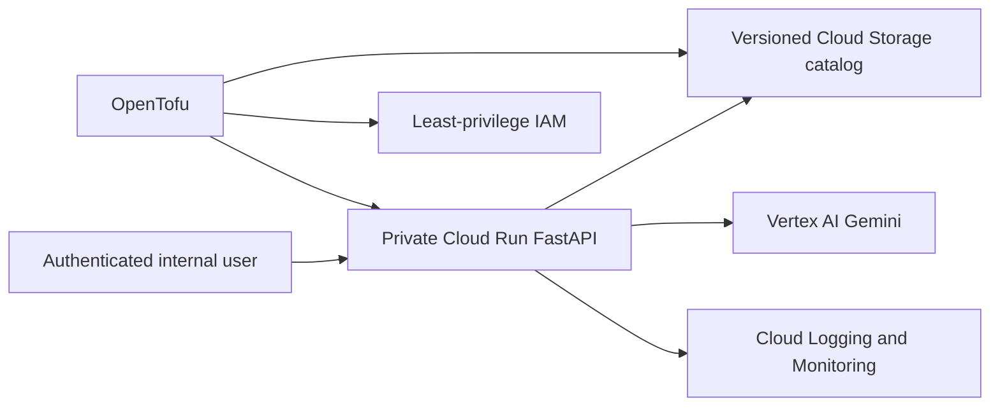

# Architecture and decisions

The API retrieves bounded evidence, invokes Gemini at temperature zero and returns source
and catalog-version citations. It fails closed to conventional search for stale catalogs
or absent evidence. React sees only versioned HTTP and Server-Sent Events contracts.

## Autonomy boundary

Use deterministic retrieval plus bounded generation, not an agent: no dynamic tool choice
is required. Compare a bounded read-only agent only if variable product lookups become
necessary. Remove autonomy after any unauthorized or incorrect action, or when measured
completion gain does not justify latency, cost and operational risk.

## Decision experiment

Use 30–50 representative queries to compare deterministic RAG and a read-only agent for
one week on correctness, groundedness, latency, cost and unsafe tool attempts. The service
owner decides and records dissent; lack of consensus does not block the safer demo.
