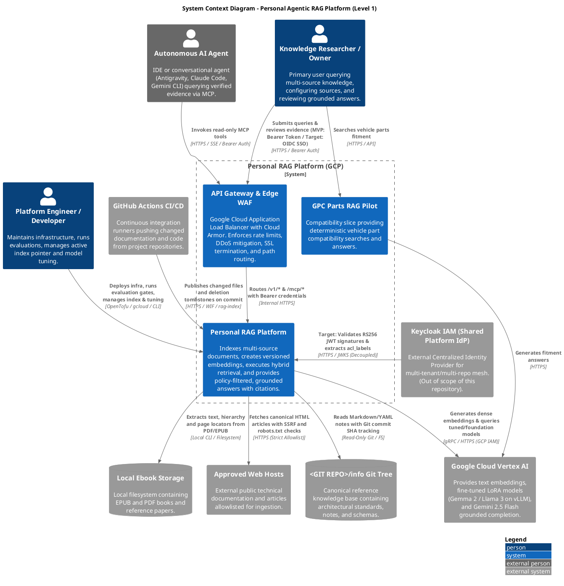
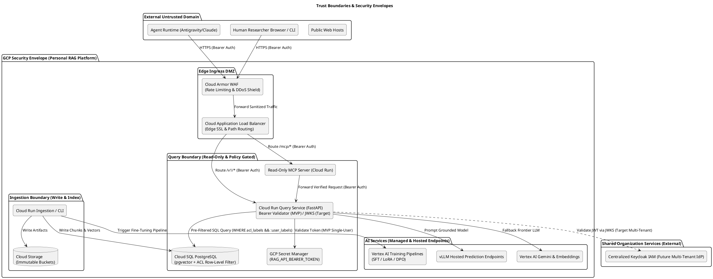

# C4 Level 1: System Context

This document describes the **System Context (Level 1)** of the Personal Agentic RAG Platform, defining the system boundaries, human actors, autonomous agents, Keycloak identity management, and external cloud systems.

---

## 1. System Context Diagram

---

## 2. Actors & Personas

| Actor | Role & Responsibilities | Interaction Channels | Security Context |
|---|---|---|---|
| **Knowledge Researcher / Owner** | Single human owner. Formulates complex multi-source research queries, approves source descriptors, and inspects citations down to source locators. | Web UI, CLI (`personal_rag.query`), HTTPS API | **MVP**: Pre-shared Bearer Token from Secret Manager. **Target**: Keycloak OIDC SSO (`realm-admin`). |
| **Platform Engineer / Developer** | Operates OpenTofu infrastructure, verifies eval benchmarks, monitors ingestion lag, trains/tunes LoRA models, and manages candidate index activations. | Windows PowerShell, WSL Linux (`tofu`, `gcloud`, `make`) | Authenticated GCP Operator (`roles/run.admin`, `roles/aiplatform.admin`). |
| **Autonomous AI Agent** | External agent (e.g., Google Antigravity, Claude Code, Cursor) needing factual grounding to write code, design architectures, or verify policies. | Model Context Protocol (MCP) over HTTPS | **MVP**: Scoped Bearer Token. **Target**: Keycloak Client Credentials JWT. |
| **Project CI/CD Runner** | Automated workflow executing in project repositories on push/merge to publish updated documentation and code into the index. | `rag-index` CLI via GitHub Actions | Keyless Workload Identity Federation (WIF) mapped to `roles/run.invoker`. |

---

## 3. External & Core Supporting Systems

### 3.1 Cloud Edge API Gateway & Cloud Armor WAF
- **Role**: Unified ingress entry point for all external client traffic.
- **Key Responsibilities**:
  - Global SSL/TLS termination using automated Google-managed certificates on custom domains.
  - DDoS protection and Layer-7 rate limiting (e.g., 120 req/min for query APIs).
  - Path-based routing: `/v1/*` $\rightarrow$ Query API, `/mcp/*` $\rightarrow$ Read-Only MCP Server, `/health` $\rightarrow$ Status.

### 3.2 Keycloak Identity & Access Management (Shared Platform - Out of Scope)
- **Role**: Independent, organization-wide Identity Provider deployed in a separate shared infrastructure cluster/repository.
- **Relationship to this Project**:
  - **Decoupled Architecture**: This repository does NOT provision, host, or manage Keycloak.
  - **Resource Server Integration (Phase 2)**: FastAPI Query API operates purely as an OAuth2 Resource Server, validating incoming JWTs against Keycloak's public JWKS endpoint (`/protocol/openid-connect/certs`).
  - **MVP Mode (Phase 1)**: Keycloak is bypassed in favor of a single-user pre-shared Bearer Token stored in GCP Secret Manager, allowing immediate deployment with zero overhead.

### 3.3 Google Cloud Vertex AI & Hosted Models
- **Role**: Foundational AI, custom fine-tuning, and model serving platform.
- **Capabilities**:
  - **Text Embeddings**: `text-embedding-004` and domain-adapted contrastive embedding models.
  - **GCP Hosted & Tuned LLMs**: Google Gemma 2 (9B/27B) and Llama 3 (8B/70B) fine-tuned with PEFT/LoRA and DPO on Vertex AI Custom Training, deployed on `vLLM` high-throughput prediction endpoints.
  - **Frontier LLM**: Gemini 2.5 Flash for high-capacity multi-hop reasoning.

### 3.4 Canonical Knowledge Base & Sources
- **`tt-root/info` Knowledge Base**: Canonical personal knowledge tree containing foundational engineering standards, AI lifecycle documents, and domain notes via read-only Git filesystem.
- **Local Windows Ebook Storage**: PDF/EPUB technical books parsed with page/chapter locator provenance.
- **Approved Web Hosts**: Outbound HTTPS fetching with strict SSRF defenses, DNS pinning, and `robots.txt` compliance.

---

## 4. Trust Boundaries & Security Envelopes

