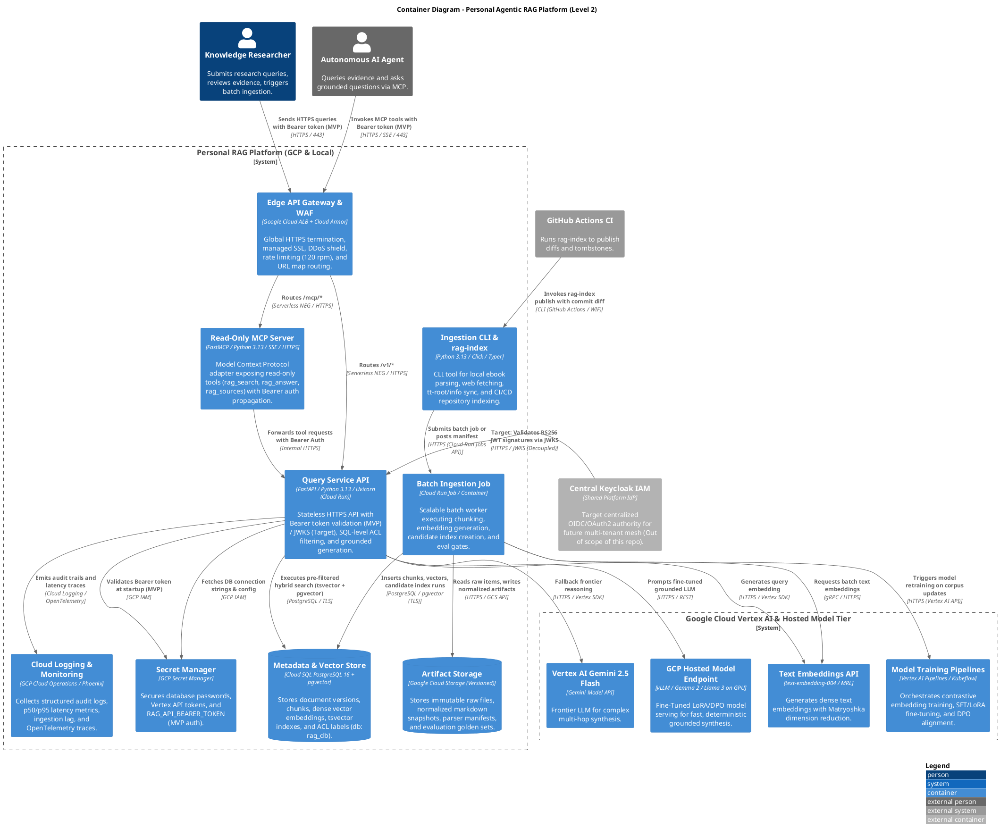

# C4 Level 2: Containers

This document specifies the **Container Architecture (Level 2)** of the Personal Agentic RAG Platform, detailing the applications, batch jobs, datastores, Keycloak security server, and GCP hosted model endpoints.

---

## 1. Container Diagram



---

## 2. Container Inventory & Specifications

### 2.1 Edge API Gateway & WAF (Cloud Application Load Balancer + Cloud Armor)
- **Role**: Edge ingress, TLS termination, WAF protection, rate limiting, and URL path dispatching.
- **Routing Rules**:
  - `api.<domain>/v1/*` $\rightarrow$ `rag-query-api` Cloud Run Service
  - `api.<domain>/mcp/*` $\rightarrow$ `rag-mcp-server` Cloud Run Service
  - `api.<domain>/health` $\rightarrow$ Query API healthcheck
- **Cloud Armor Security Policy**:
  - **Rate Limiting**: 120 req/min per IP on `/v1/*` APIs.
  - **Preconfigured WAF Rules**: SQLi (`sqli-canary`), XSS (`xss-canary`), and Protocol Attack mitigations.
  - **SSL Certificates**: Automated Google-managed multi-domain SSL certificates.

### 2.2 Query Service API (`dev-tt-rag-parts` / Cloud Run)
- **Role**: Core serving container handling authenticated search, grounded question answering, and catalog lookups.
- **Security & Authentication Architecture**:
  - **MVP Mode (Single-User)**: Intercepts `Authorization: Bearer <token>` and validates against `RAG_API_BEARER_TOKEN` stored in **GCP Secret Manager**. Binds static single-user context:
    ```python
    PrincipalContext(
        user_id="owner",
        username="tomasz",
        roles=["owner", "admin"],
        acl_labels=["owner:tomasz", "visibility:private", "visibility:public"]
    )
    ```
  - **Target Mode (Decoupled Keycloak Resource Server)**: Validates incoming Bearer JWT tokens against the external shared Keycloak JWKS endpoint (`https://auth.yourdomain.com/.../certs`) with in-memory caching. Extracts dynamic multi-tenant `acl_labels`.

### 2.3 Read-Only MCP Server (`rag-mcp-server` / Cloud Run)
- **Role**: Model Context Protocol adapter for external AI agents.
- **Authentication**: Accepts agent Bearer tokens and propagates the credentials down to the Query Service API.
- **Protocol Support**: Native HTTP Streaming and Server-Sent Events (SSE) for agent tool invocations.

### 2.4 GCP Hosted Model Prediction Endpoint (`vLLM` on Vertex AI)
- **Role**: Low-latency, dedicated model serving container for domain-fine-tuned models.
- **Engine**: `vLLM` container with PagedAttention and FP8/AWQ quantization running on NVIDIA L4 GPU.
- **Models Served**: Domain-adapted Gemma 2 9B / Llama 3 8B with merged LoRA weights for exact citation formatting and strict abstention.

### 2.5 Batch Ingestion Job & Model Training Pipelines
- **Batch Ingestion Job**: Run-to-completion Cloud Run Job parsing, chunking, and staging candidate index runs.
- **Vertex AI Pipelines**: Automated Kubeflow DAG triggered when significant new corpus snapshots are added, running triplet-loss embedding fine-tuning and LoRA instruction tuning.

### 2.6 External Shared Keycloak IdP (Target Evolution - Out of Scope)
- **Role**: Centralized identity provider for multi-tenant and multi-agent meshes across independent repositories.
- **Contract**: Exposes standard OIDC/OAuth2 discovery and JWKS endpoints; this repository contains zero Keycloak container or database definitions.
