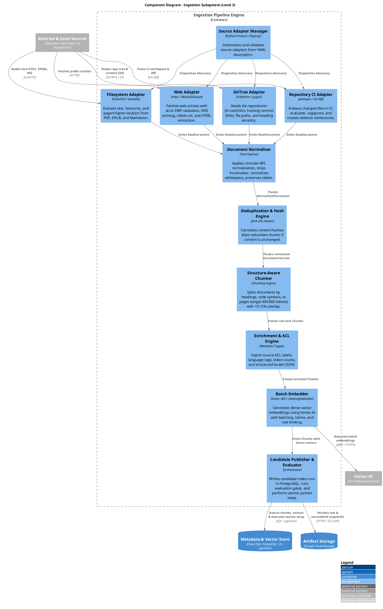

# C4 Level 3: Components - Ingestion Subsystem

This document specifies the **Component Architecture (Level 3)** of the **Ingestion Subsystem**, detailing the modular adapters, normalizers, chunkers, enrichers, embedders, and publishing engines.

---

## 1. Ingestion Component Diagram



---

## 2. Component Specifications & Interfaces

### 2.1 Source Adapter Protocol (`src/personal_rag/sources/base.py`)
All connectors implement the unified `SourceAdapter` protocol, ensuring the ingestion engine remains completely decoupled from physical source formats.

```python
class SourceAdapter(Protocol):
    source_type: str

    def discover(self, request: DiscoveryRequest) -> Iterable[SourceItem]:
        """Scans the source root and yields discoverable items."""
        ...

    def fetch(self, item: SourceItem) -> RawDocument:
        """Fetches raw content and returns standardized RawDocument."""
        ...

    def fingerprint(self, document: RawDocument) -> str:
        """Computes deterministic hash from content and metadata."""
        ...
```

---

### 2.2 Concrete Source Adapters

#### A. Filesystem Adapter (`personal_rag.sources.filesystem`)
- **Supported Formats**: `.pdf`, `.epub`, `.md`, `.txt`, `.yaml`.
- **PDF Engine**: Uses PyMuPDF / `pdfplumber` to extract page-by-page text, preserving page numbers in `locator_json = {"page": N}`.
- **EPUB Engine**: Uses `ebooklib` to parse the spine, extracting HTML chapters while recording chapter headings in `locator_json = {"chapter": "Title"}`.
- **Safety**: Validates that resolved target paths reside within the configured root directory (guarding against Windows junction escape attacks).

#### B. Web Adapter (`personal_rag.sources.web`)
- **Protocol**: Outbound HTTPS client with strict SSRF defenses.
- **Security Controls**:
  - Rejects private IP ranges (`10.0.0.0/8`, `172.16.0.0/12`, `192.168.0.0/16`, `127.0.0.0/8`, `169.254.169.254` GCP metadata).
  - Validates DNS before request and pins socket connection to prevent DNS rebinding.
  - Validates redirects recursively against the same IP/host allowlist.
  - Fetches and honors `/robots.txt` before fetching article content.
  - Enforces response limits (max 10 MB, 15-second timeout, `text/html` MIME types only).
- **Content Extraction**: Strips navigation, headers, footers, scripts, and ads using readability algorithms, emitting clean Markdown text with preserved headings.

#### C. GitTree Adapter (`personal_rag.sources.git_tree`)
- **Target**: `tt-root/info` and local reference repositories.
- **Provenance Tracking**: Captures current Git commit SHA, branch ref, relative path, and top-level heading.
- **Language Handling**: Preserves Polish legacy material with `language: "pl"` in metadata without automated translation.

#### D. Repository CI Adapter (`personal_rag.sources.repository_ci`)
- **Execution Target**: Triggered by `rag-index` in GitHub Actions workflows.
- **Diff Analysis**: Uses `git diff --name-status` against the merge base to isolate added, modified, and deleted files.
- **Ignore Rules**: Evaluates `.ragignore` file patterns using `pathspec`, failing closed on invalid patterns.
- **Tombstones**: Generates explicit deletion tombstones for files deleted in the commit range.

---

### 2.3 Pipeline Processing Components

#### 1. Document Normalizer (`personal_rag.pipeline.normalize`)
- Applies Unicode NFC normalization.
- Removes Jekyll/Hugo YAML frontmatter while preserving metadata tags.
- Normalizes carriage returns (`\r\n` $\rightarrow$ `\n`).
- Preserves markdown tables and code blocks verbatim without destructive whitespace collapse.

#### 2. Deduplication & Hash Engine (`personal_rag.pipeline.dedup`)
- Generates SHA-256 hash of normalized text and metadata.
- Queries Cloud SQL / `DocumentIndex` to verify if `content_hash` has already been indexed.
- If hash matches the active document version, marks item as `UNMODIFIED` and skips chunking and embedding steps.

#### 3. Structure-Aware Chunker (`personal_rag.pipeline.chunk`)
- **Heading-Aware Splitter**: Splits Markdown/HTML documents along `#`, `##`, `###` headings, populating `heading_path` (e.g., `["Architecture", "Storage", "pgvector"]`).
- **Token Budget**: Targets 400–800 tokens per chunk. Headings are never merged across sibling topics.
- **Code Splitter**: Splits source code files along class and function definitions, maintaining file header imports in every chunk.
- **Overlap**: Maintains 10–15% token overlap between adjacent chunks within the same section.

#### 4. Enrichment & ACL Engine (`personal_rag.pipeline.enrich`)
- Assigns deterministic `chunk_id` (`f"{doc_id}:{ordinal:04d}"`).
- Injects source-level ACL tags (e.g., `["owner:tomasz", "visibility:private"]`).
- Generates structured `locator_json` containing page numbers, chapter titles, line numbers, or URL fragments.
- Generates PostgreSQL `tsvector` lexical tokens using language-specific dictionaries (`english`, `polish`, `simple`).

#### 5. Batch Embedder (`personal_rag.pipeline.embed`)
- Implements the `Embedder` protocol.
- **Production (`VertexAIEmbedder`)**: Submits batches of up to 100 texts to Vertex AI embedding API (`text-embedding-004`), using exponential backoff on HTTP 429 / 503.
- **Testing (`HashingEmbedder`)**: Deterministic 64-dimensional feature hash for fast, offline, zero-cost unit testing.

#### 6. Candidate Publisher & Evaluator (`personal_rag.pipeline.publish`)
- Inserts new document versions and chunks into a new `ingestion_run_id` with status `CANDIDATE`.
- Executes automated retrieval evaluation against golden/negative test sets.
- If evaluation passes: executes an atomic database transaction that points `active_index_pointer` to the candidate run and marks previous versions as `TOMBSTONED`.
- If evaluation fails: marks run as `QUARANTINED`, preserving diagnostics for engineer inspection without affecting live queries.
