# C4 Level 3: Components - Query Engine & Agent Boundary

This document specifies the **Component Architecture (Level 3)** of the **Query Engine & Agent Boundary**, detailing Keycloak JWT authentication, hybrid retrieval mechanisms, rank fusion, grounding validation, strict abstention policies, and the read-only Model Context Protocol (MCP) server.

---

## 1. Query Engine Component Diagram

```plantuml
@startuml "04-components-query"
!include <C4/C4_Component>

LAYOUT_WITH_LEGEND()

title Component Diagram - Query Engine & Agent Boundary (Level 3)

Person(user, "Authenticated User / Researcher", "Submits search and question requests with Bearer token.")
Person_Ext(agent, "AI Agent (Antigravity/Claude)", "Invokes MCP tools with Bearer token.")
Container(gateway, "Cloud ALB + Cloud Armor", "Edge WAF & Gateway", "Rate limiting, DDoS shield, and URL map routing.")
Container(secrets, "Secret Manager", "GCP Secret Manager", "Stores RAG_API_BEARER_TOKEN (MVP)")
Container_Ext(keycloak, "Keycloak IAM (Shared Platform)", "External IdP", "Target multi-tenant OIDC/JWKS provider (Future)")
ContainerDb(sql_db, "Metadata & Vector Store", "Cloud SQL PostgreSQL 16 (pgvector + FTS)")
Container_Ext(vllm_ep, "GCP Hosted Model Endpoint", "vLLM (Fine-Tuned Gemma/Llama)")
Container_Ext(vertex, "Vertex AI", "Gemini 2.5 Flash & text-embedding-004")
Container(telemetry, "Cloud Operations & Phoenix", "Logging, Metrics & Tracing")

Container_Boundary(query_service, "Query Service (FastAPI)") {
    Component(rate_limiter, "In-App Rate Limiter & IP Throttler", "slowapi / Redis / Memory", "Sliding-window token bucket enforcement per user and IP.")
    Component(auth_guard, "Auth Guard & Security Middleware", "FastAPI / HMAC / PyJWT", "MVP: Constant-time Bearer token check from Secret Manager.\nTarget: JWKS validation against shared Keycloak.")
    Component(api_router, "FastAPI Router & Request Validator", "FastAPI / Pydantic v2", "Validates request payloads, bounds top_k, and checks source_ids filters.")
    Component(query_norm, "Query Normalizer", "Text Pipeline", "Cleans query strings, builds tsquery expressions, and formats embedding requests.")
    
    Component(hybrid_retriever, "Hybrid Retriever", "SQL / pgvector Query Engine", "Executes parallel sparse tsvector FTS and dense cosine vector searches with SQL-level ACL filters.")
    Component(rrf_fusion, "Reciprocal Rank Fusion (RRF)", "Rank Merger", "Fuses sparse and dense candidate lists using RRF formula (k=60), producing combined ranking.")
    
    Component(evidence_mgr, "Evidence Budgeter & Deduplicator", "Context Assembler", "Selects top-k candidates, enforces token budget (e.g. 4000 tokens), ensures source diversity.")
    Component(generator_router, "Model Router & Prompt Formatter", "Python LLM Client", "Formats XML context; routes to fine-tuned vLLM model or Vertex AI Gemini.")
    Component(citation_validator, "Citation & Claim Validator", "Grounding Engine", "Verifies that returned citations reference valid retrieved chunk IDs and source versions.")
    Component(abstention_gate, "Abstention Gate", "Safety Filter", "Forces graceful abstention when retrieval score is below threshold or evidence is insufficient.")
}

Container_Boundary(mcp_boundary, "Read-Only MCP Server (Cloud Run)") {
    Component(mcp_handler, "MCP Tool Handler", "FastMCP / SSE", "Dispatches tool calls (rag_search, rag_answer, rag_sources, rag_ingestion_status).")
    Component(mcp_client, "Internal Query Client", "httpx Client", "Translates MCP tool invocations into typed HTTPS calls with forwarded Bearer token.")
}

Rel(user, gateway, "HTTPS requests (Bearer Auth)", "HTTPS / 443")
Rel(agent, gateway, "MCP tool calls (Bearer Auth)", "HTTPS / SSE / 443")

Rel(gateway, api_router, "Routes /v1/*", "Serverless NEG / HTTPS")
Rel(gateway, mcp_handler, "Routes /mcp/*", "Serverless NEG / HTTPS")

Rel(mcp_handler, mcp_client, "Translates tool arguments & attaches token")
Rel(mcp_client, api_router, "Calls /v1/* endpoints (Bearer Auth)", "Internal HTTPS")

Rel(api_router, rate_limiter, "Checks rate limits")
Rel(rate_limiter, auth_guard, "Passes unthrottled requests")
Rel(auth_guard, secrets, "MVP: Reads secret at startup", "GCP IAM")
Rel_Back_Neighbor(auth_guard, keycloak, "Target: Fetches public keys (cached in-memory)", "HTTPS / JWKS")
Rel(auth_guard, api_router, "Returns PrincipalContext(user_id, acl_labels)")

Rel(api_router, query_norm, "Passes validated request + ACL context")
Rel(query_norm, hybrid_retriever, "Passes normalized query + ACL labels")
Rel(hybrid_retriever, sql_db, "Runs parameterized SQL query with WHERE acl_labels && :user_labels", "PostgreSQL / TLS")
Rel(hybrid_retriever, rrf_fusion, "Returns sparse & dense ranked lists")
Rel(rrf_fusion, evidence_mgr, "Returns fused candidate chunks")

Rel(evidence_mgr, abstention_gate, "Checks minimum retrieval score & candidate count")
Rel(abstention_gate, generator_router, "Passes approved evidence budget")
Rel(generator_router, vllm_ep, "Prompts fine-tuned model (temp=0.0)", "HTTPS / REST")
Rel(generator_router, vertex, "Fallback complex reasoning", "HTTPS / Vertex SDK")
Rel(generator_router, citation_validator, "Passes raw LLM completion")
Rel(citation_validator, api_router, "Returns verified answer with valid citations")

@enduml
```



---

## 2. Authentication & Authorization Middleware

The platform implements a **pluggable two-phase authentication middleware** (`UnifiedAuthMiddleware`):

### 2.1 Implementation Code (MVP Token & Target JWKS)

```python
import hmac
from fastapi import HTTPException, Request
from starlette.middleware.base import BaseHTTPMiddleware
import jwt

class UnifiedAuthMiddleware(BaseHTTPMiddleware):
    def __init__(self, app, expected_bearer_token: str, keycloak_jwks_url: str = None, audience: str = None, issuer: str = None):
        super().__init__(app)
        self.expected_bearer_token = expected_bearer_token
        self.keycloak_jwks_url = keycloak_jwks_url
        self.audience = audience
        self.issuer = issuer
        self.jwks_client = jwt.PyJWKClient(keycloak_jwks_url, cache_jwk_set=True, lifespan=3600) if keycloak_jwks_url else None

    async def dispatch(self, request: Request, call_next):
        if request.url.path in ["/v1/health", "/docs", "/openapi.json"]:
            return await call_next(request)

        auth_header = request.headers.get("Authorization")
        if not auth_header or not auth_header.startswith("Bearer "):
            raise HTTPException(status_code=401, detail="Missing or invalid Authorization header")

        token = auth_header.split(" ")[1]

        # Phase 1: MVP Mode (Pre-Shared Bearer Token from Secret Manager)
        if self.expected_bearer_token:
            if hmac.compare_digest(token, self.expected_bearer_token):
                request.state.user_id = "owner"
                request.state.username = "tomasz"
                request.state.roles = ["owner", "admin"]
                request.state.acl_labels = ["owner:tomasz", "visibility:private", "visibility:public"]
                return await call_next(request)
            elif not self.jwks_client:
                raise HTTPException(status_code=401, detail="Invalid Bearer token")

        # Phase 2: Target Mode (Decoupled Shared Keycloak OIDC JWKS)
        if self.jwks_client:
            try:
                signing_key = self.jwks_client.get_signing_key_from_jwt(token)
                payload = jwt.decode(
                    token,
                    signing_key.key,
                    algorithms=["RS256"],
                    audience=self.audience,
                    issuer=self.issuer,
                    options={"require": ["exp", "iss", "sub", "acl_labels"]}
                )
                request.state.user_id = payload.get("sub")
                request.state.username = payload.get("preferred_username")
                request.state.roles = payload.get("realm_access", {}).get("roles", [])
                request.state.acl_labels = payload.get("acl_labels", ["visibility:public"])
                return await call_next(request)
            except Exception as err:
                raise HTTPException(status_code=401, detail=f"Token validation failed: {str(err)}")

        raise HTTPException(status_code=401, detail="Unauthorized")
```

---

## 3. OpenAPI Endpoint Contracts & Pydantic Schemas

### 3.1 `POST /v1/search` (Hybrid Retrieval)
Executes pre-filtered dense & sparse search across active indexes.

```json
{
  "query": "string (1-1000 chars)",
  "top_k": 8,
  "source_ids": ["ebooks", "tt-root-info"],
  "min_score": 0.016
}
```

**Response Schema (`SearchResponse`)**:
```json
{
  "query": "pgvector index configuration",
  "results_count": 5,
  "execution_time_ms": 118.4,
  "chunks": [
    {
      "chunk_id": "ebooks:postgres_ai:ch3:p45#002",
      "document_id": "ebooks:postgres_ai:ch3",
      "text": "When creating an HNSW index on pgvector...",
      "heading_path": ["Chapter 3: Vector Search", "3.2 HNSW Indexing"],
      "locator": {"chapter": "Chapter 3", "page": 45},
      "rrf_score": 0.0325,
      "acl_labels": ["owner:tomasz", "visibility:private"]
    }
  ]
}
```

### 3.2 `POST /v1/answer` (Grounded Q&A Synthesis)
Generates cited answers strictly entailed by the retrieved evidence.

```json
{
  "query": "How is index rollback executed?",
  "token_budget": 4000,
  "source_ids": ["tt-root-info"],
  "model_preference": "auto"
}
```

**Response Schema (`AnswerResponse`)**:
```json
{
  "query": "How is index rollback executed?",
  "answer": "Index rollback is executed by atomically updating the active_index_pointers table in PostgreSQL to reference the prior stable run ID [tt-root-info:runbooks:rb_rollback#001].",
  "status": "grounded",
  "abstained": false,
  "citations": [
    {
      "citation_id": 1,
      "chunk_id": "tt-root-info:runbooks:rb_rollback#001",
      "source_title": "Runbook: Index Activation & Emergency Rollback",
      "locator": {"git_commit": "c4d5e6f7", "path": "docs/runbooks/rollback.md"}
    }
  ],
  "latency_ms": 462.1
}
```

---

## 4. Rate Limiting, Security Headers & Ingress Policy

### 4.1 Rate Limiting Policy
- **Global Layer (Cloud Armor WAF)**:
  - Max 120 requests/minute per client IP across all `/v1/*` endpoints.
  - Max 30 requests/minute per client IP across `/auth/*` login endpoints.
- **Application Layer (`slowapi`)**:
  - Max 60 queries/minute per authenticated `user_id` / agent `client_id`.
  - Violations return `HTTP 429 Too Many Requests` with `Retry-After` headers.

### 4.2 Security Headers & CORS Policy
Every response emitted by the Query API injects hardened HTTP headers:
- `Strict-Transport-Security: max-age=63072000; includeSubDomains; preload`
- `X-Content-Type-Options: nosniff`
- `X-Frame-Options: DENY`
- `Content-Security-Policy: default-src 'none'; frame-ancestors 'none';`
- `Access-Control-Allow-Origin`: Restricts web UI origins; rejects wildcard `*` with credentials.
- `Traceparent` / `X-Request-ID`: Distributed W3C trace context header passed across microservice spans.

---

## 5. Hybrid Retrieval & RRF Ranking

#### SQL Pre-Filter & Hybrid Execution
The query executes against the active index in a single parameterized SQL query utilizing the extracted `acl_labels`:

```sql
WITH sparse_candidates AS (
    SELECT chunk_id, document_id, text, heading_path, locator_json,
           ts_rank_cd(lexical_text_vector, to_tsquery('english', :query_text)) AS sparse_score,
           ROW_NUMBER() OVER (ORDER BY ts_rank_cd(lexical_text_vector, to_tsquery('english', :query_text)) DESC) AS sparse_rank
    FROM chunks
    WHERE index_run_id = (SELECT active_run_id FROM active_index_pointers LIMIT 1)
      AND acl_labels && :principal_acl_labels
      AND lexical_text_vector @@ to_tsquery('english', :query_text)
    LIMIT 50
),
dense_candidates AS (
    SELECT chunk_id, document_id, text, heading_path, locator_json,
           1 - (dense_embedding <=> :query_embedding) AS dense_score,
           ROW_NUMBER() OVER (ORDER BY dense_embedding <=> :query_embedding ASC) AS dense_rank
    FROM chunks
    WHERE index_run_id = (SELECT active_run_id FROM active_index_pointers LIMIT 1)
      AND acl_labels && :principal_acl_labels
      AND (1 - (dense_embedding <=> :query_embedding)) >= :dense_floor
    LIMIT 50
)
SELECT COALESCE(s.chunk_id, d.chunk_id) AS chunk_id,
       COALESCE(s.text, d.text) AS text,
       COALESCE(s.heading_path, d.heading_path) AS heading_path,
       COALESCE(s.locator_json, d.locator_json) AS locator_json,
       COALESCE(1.0 / (60 + s.sparse_rank), 0.0) + COALESCE(1.0 / (60 + d.dense_rank), 0.0) AS rrf_score
FROM sparse_candidates s
FULL OUTER JOIN dense_candidates d ON s.chunk_id = d.chunk_id
ORDER BY rrf_score DESC
LIMIT :top_k;
```
