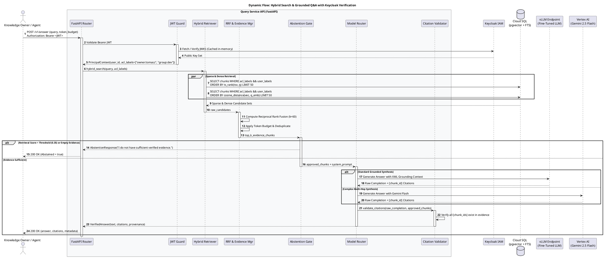
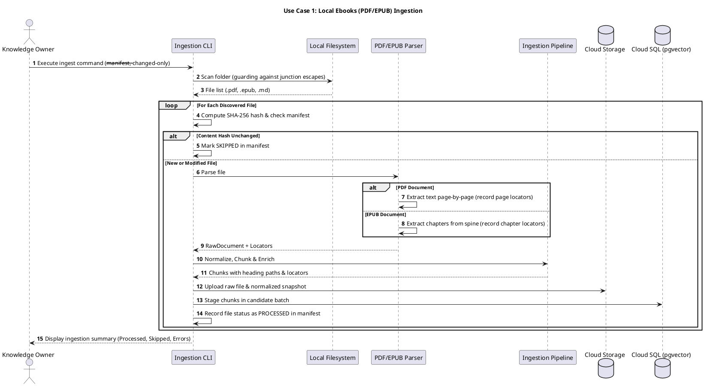
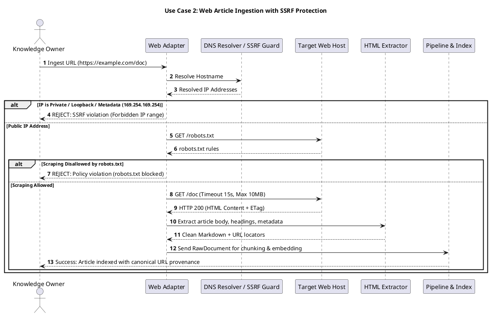
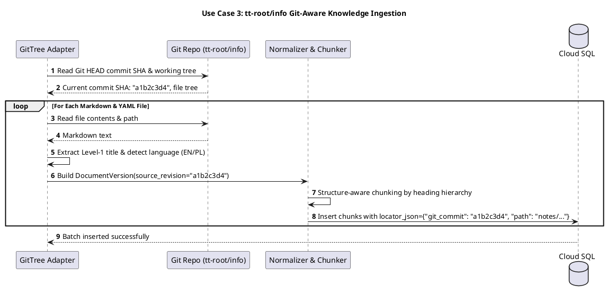
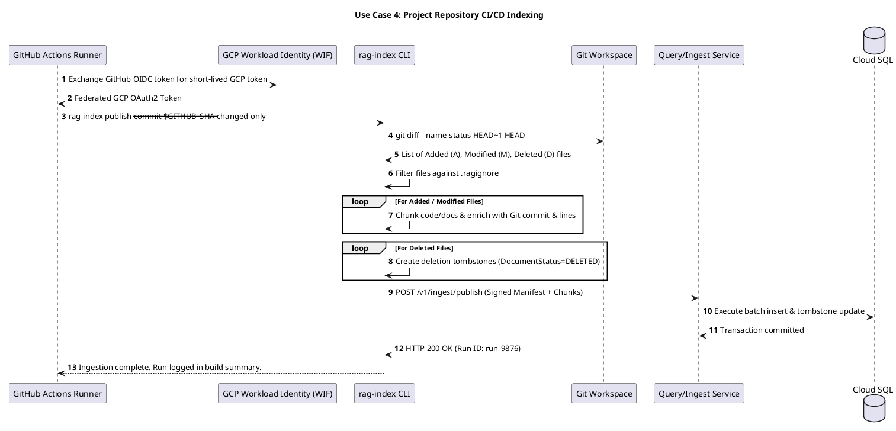
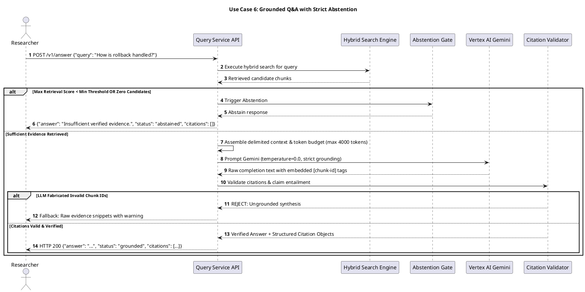
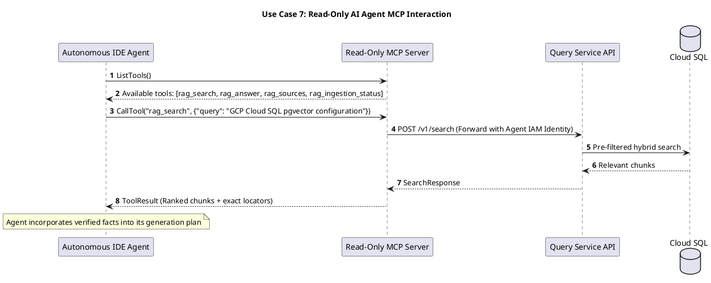
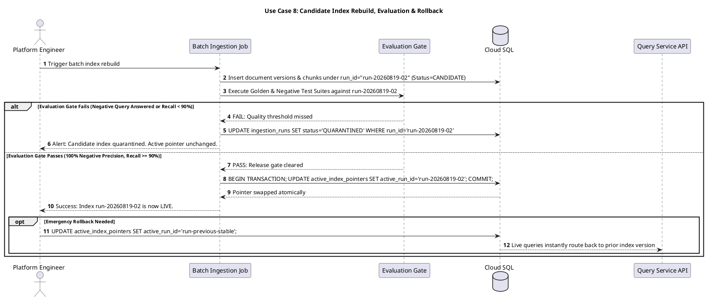
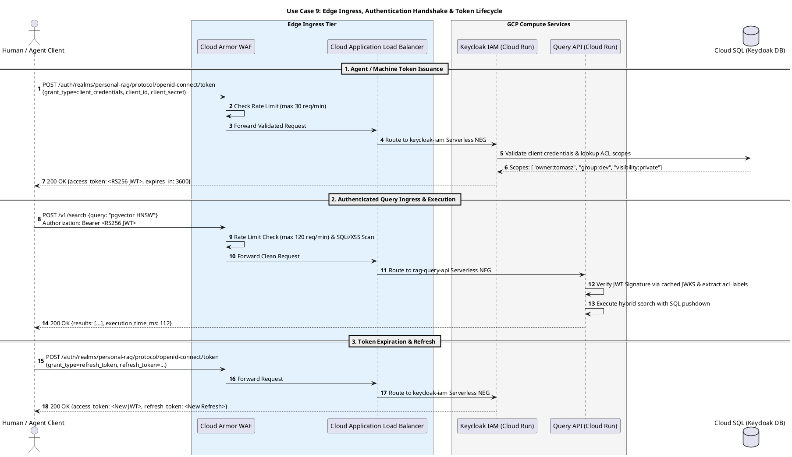

# C4 Dynamic Flows: Use Cases & Sequence Diagrams

This document specifies the **Dynamic Behavioral Architecture** of the Personal Agentic RAG Platform, providing end-to-end sequence diagrams and failure handling flows for the **8 core platform use cases**.

---

## 1. End-to-End Grounded Q&A Flow



---

## 2. Use Case 1: Local Ebooks (PDF/EPUB) Ingestion

**Trigger**: Owner runs `python -m personal_rag.ingest.filesystem --path 'ebooks/' --source-id ebooks --manifest '.rag/manifest.json'`.



---

## 3. Use Case 2: Web Article Ingestion with SSRF Protection

**Trigger**: Ingestion of an approved technical article via `python -m personal_rag.ingest.web --url 'https://docs.cloud.google.com/...'`.



---

## 4. Use Case 3: `tt-root/info` Git-Aware Knowledge Ingestion

**Trigger**: Ingestion of canonical reference notes from local/remote Git repository.



---

## 5. Use Case 4: Project Repository CI/CD Indexing

**Trigger**: GitHub Actions workflow runs on commit push to `main`.



---

## 6. Use Case 5: Hybrid Search Execution with SQL Pre-Filtering

**Trigger**: User or agent submits `POST /v1/search` with query and source filters.

```plantuml
@startuml "05-uc5-hybrid-search"
autonumber
skinparam BoxPadding 10
skinparam ParticipantPadding 10

title Use Case 5: Hybrid Search Execution with SQL Pre-Filtering

actor "User / Agent" as Caller
participant "Query Service API" as API
participant "Vertex AI" as Vertex
database "Cloud SQL (pgvector)" as SQL

Caller -> API: POST /v1/search {"query": "vector indexing", "source_ids": ["ebooks", "tt-root-info"]}
API -> API: Authenticate caller & resolve authorized ACL labels

par Generate Dense Vector
    API -> Vertex: Generate text embedding for query
    Vertex --> API: 768-dim float32 vector
and Build Sparse Query
    API -> API: Generate tsquery("vector & indexing")
end

API -> SQL: Execute Unified Hybrid SQL Query (WHERE acl_labels && user_labels)
note over SQL
  Evaluates Sparse ts_rank_cd & Dense <=> cosine in parallel,
  fuses rankings using RRF: 1/(60 + rank_sparse) + 1/(60 + rank_dense)
end note
SQL --> API: Top-K Ranked Chunks + Provenance + RRF Scores

API --> Caller: SearchResponse (Ranked chunks, source locators, scores, execution_time_ms)

@enduml
```

---

## 7. Use Case 6: Grounded Q&A with Strict Abstention

**Trigger**: User submits `POST /v1/answer` to obtain a factual, cited response.



---

## 8. Use Case 7: Read-Only AI Agent MCP Interaction

**Trigger**: Autonomous IDE Agent (Google Antigravity, Claude Code) needs project knowledge.



---

## 9. Use Case 8: Candidate Index Rebuild, Evaluation & Rollback

**Trigger**: Batch ingestion completes a new corpus index; platform validates before live swap.



---

## 10. Use Case 9: Edge Ingress, Authentication Handshake & Token Refresh

**Trigger**: Human researcher logs in via Web SSO or Autonomous Agent acquires/refreshes machine client credentials token.



