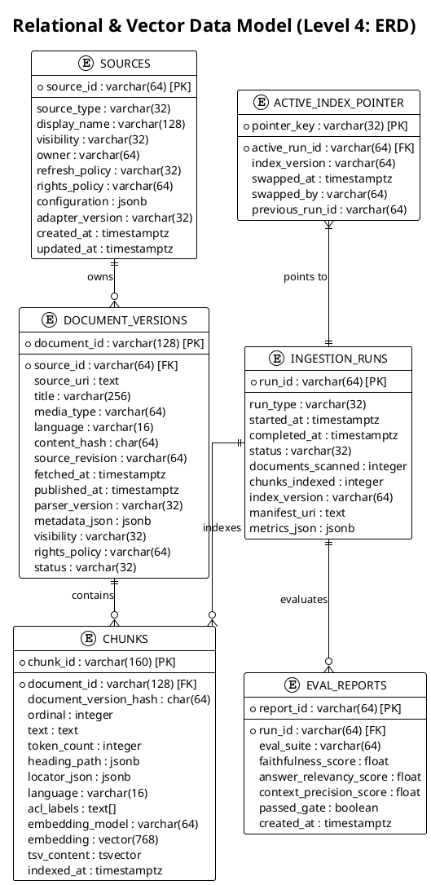
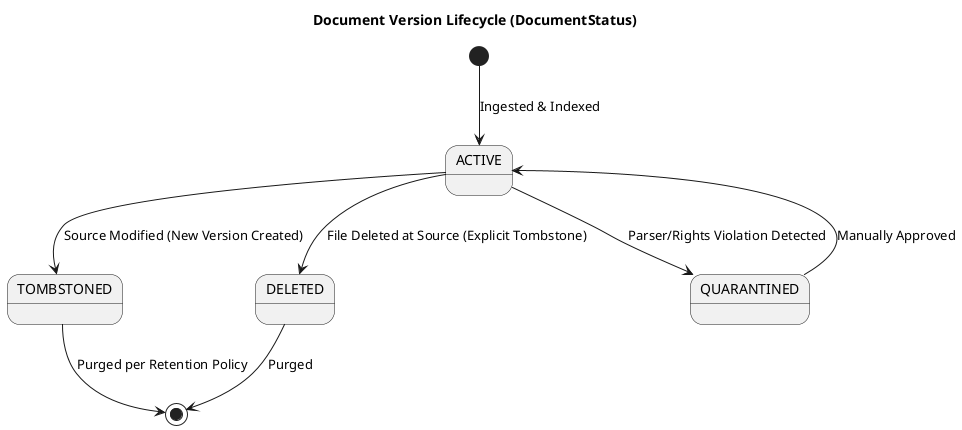
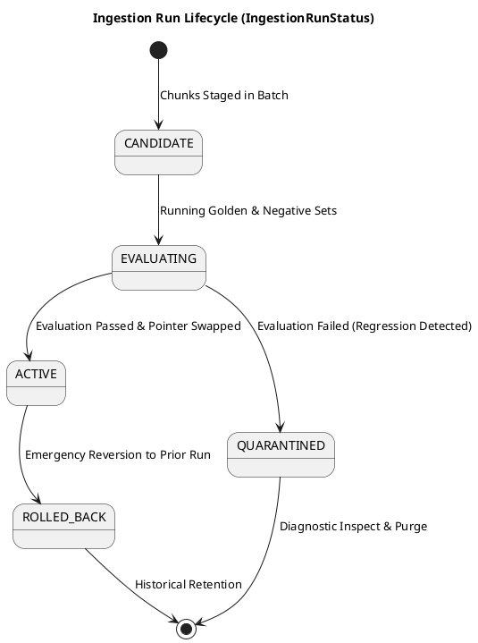

# C4 Level 4: Data & Code Models

This document specifies the **Data Architecture (Level 4)** of the Personal Agentic RAG Platform, defining the PostgreSQL relational and vector schemas, JSON contracts, locator models, and entity lifecycle state machines.

---

## 1. Entity-Relationship Diagram (ERD)



---

## 2. PostgreSQL Schema & Index Specifications

### 2.1 Database Tables DDL
```sql
-- Enable required extensions
CREATE EXTENSION IF NOT EXISTS vector;
CREATE EXTENSION IF NOT EXISTS pg_trgm;

-- Sources Registry
CREATE TABLE sources (
    source_id VARCHAR(64) PRIMARY KEY,
    source_type VARCHAR(32) NOT NULL,
    display_name VARCHAR(128) NOT NULL,
    visibility VARCHAR(32) NOT NULL DEFAULT 'private',
    owner VARCHAR(64) NOT NULL,
    refresh_policy VARCHAR(32) NOT NULL,
    rights_policy VARCHAR(64) NOT NULL,
    configuration JSONB NOT NULL DEFAULT '{}'::jsonb,
    adapter_version VARCHAR(32) NOT NULL,
    created_at TIMESTAMPTZ NOT NULL DEFAULT NOW(),
    updated_at TIMESTAMPTZ NOT NULL DEFAULT NOW()
);

-- Document Versions Table
CREATE TABLE document_versions (
    document_id VARCHAR(128) NOT NULL,
    source_id VARCHAR(64) NOT NULL REFERENCES sources(source_id),
    source_uri TEXT NOT NULL,
    title VARCHAR(256) NOT NULL,
    media_type VARCHAR(64) NOT NULL,
    language VARCHAR(16) NOT NULL DEFAULT 'en',
    content_hash CHAR(64) NOT NULL,
    source_revision VARCHAR(64) NOT NULL,
    fetched_at TIMESTAMPTZ NOT NULL,
    published_at TIMESTAMPTZ,
    parser_version VARCHAR(32) NOT NULL,
    metadata_json JSONB NOT NULL DEFAULT '{}'::jsonb,
    visibility VARCHAR(32) NOT NULL DEFAULT 'private',
    rights_policy VARCHAR(64) NOT NULL,
    status VARCHAR(32) NOT NULL DEFAULT 'active',
    PRIMARY KEY (document_id, content_hash)
);

-- Ingestion Runs Table
CREATE TABLE ingestion_runs (
    run_id VARCHAR(64) PRIMARY KEY,
    source_id VARCHAR(64) NOT NULL REFERENCES sources(source_id),
    trigger_type VARCHAR(32) NOT NULL,
    status VARCHAR(32) NOT NULL DEFAULT 'candidate',
    documents_processed INTEGER NOT NULL DEFAULT 0,
    chunks_created INTEGER NOT NULL DEFAULT 0,
    tombstones_created INTEGER NOT NULL DEFAULT 0,
    cost_estimate_usd NUMERIC(10, 4) DEFAULT 0.0,
    started_at TIMESTAMPTZ NOT NULL DEFAULT NOW(),
    completed_at TIMESTAMPTZ,
    summary_json JSONB NOT NULL DEFAULT '{}'::jsonb
);

-- Chunks Table with Full-Text and Vector Indexes
CREATE TABLE chunks (
    chunk_id VARCHAR(160) PRIMARY KEY,
    document_id VARCHAR(128) NOT NULL,
    document_version_hash CHAR(64) NOT NULL,
    ordinal INTEGER NOT NULL,
    text TEXT NOT NULL,
    token_count INTEGER NOT NULL,
    heading_path JSONB NOT NULL DEFAULT '[]'::jsonb,
    locator_json JSONB NOT NULL DEFAULT '{}'::jsonb,
    language VARCHAR(16) NOT NULL DEFAULT 'en',
    acl_labels TEXT[] NOT NULL DEFAULT '{}',
    embedding_model VARCHAR(64) NOT NULL,
    embedding_dimensions INTEGER NOT NULL,
    chunker_version VARCHAR(32) NOT NULL,
    lexical_text_vector TSVECTOR GENERATED ALWAYS AS (to_tsvector('english', text)) STORED,
    dense_embedding VECTOR(768),
    index_run_id VARCHAR(64) NOT NULL REFERENCES ingestion_runs(run_id),
    created_at TIMESTAMPTZ NOT NULL DEFAULT NOW()
);

-- Active Index Pointer Table (Single-row table)
CREATE TABLE active_index_pointers (
    id INTEGER PRIMARY KEY DEFAULT 1 CHECK (id = 1),
    active_run_id VARCHAR(64) NOT NULL REFERENCES ingestion_runs(run_id),
    activated_at TIMESTAMPTZ NOT NULL DEFAULT NOW(),
    activated_by VARCHAR(64) NOT NULL,
    reason VARCHAR(256) NOT NULL
);
```

### 2.2 Performance Indexing Strategy
```sql
-- Fast ACL and Source filtering
CREATE INDEX idx_chunks_acl_labels ON chunks USING GIN(acl_labels);
CREATE INDEX idx_chunks_run_id ON chunks (index_run_id);

-- Full-Text Lexical Search Index (GIN)
CREATE INDEX idx_chunks_lexical ON chunks USING GIN(lexical_text_vector);

-- Dense Vector Search Index (HNSW for high recall and low query latency)
CREATE INDEX idx_chunks_dense_vector ON chunks 
USING hnsw (dense_embedding vector_cosine_ops)
WITH (m = 16, ef_construction = 64);
```

---

## 3. Provenance Locator Schemas

Every chunk stores a structured `locator_json` object enabling human-verifiable citations:

| Source Type | Locator JSON Schema | Example Payload |
|---|---|---|
| **Ebook (PDF)** | `{"page": int, "total_pages": int}` | `{"page": 42, "total_pages": 380}` |
| **Ebook (EPUB)** | `{"chapter": str, "section": str}` | `{"chapter": "Chapter 3: Vector Indexing", "section": "3.2 HNSW vs IVFFlat"}` |
| **Web Article** | `{"canonical_url": str, "fragment": str, "fetched_at": str}` | `{"canonical_url": "https://cloud.google.com/sql/docs/postgres/ai-overview", "fragment": "using-pgvector", "fetched_at": "2026-08-19T08:00:00Z"}` |
| **`tt-root/info`** | `{"git_commit": str, "path": str, "heading": str}` | `{"git_commit": "c4d5e6f7", "path": "knowledge-base/part-3-ai-engineering/12-rag-pipelines.md", "heading": "Retrieval Evaluation Gate"}` |
| **Project Repo** | `{"repo": str, "commit": str, "path": str, "lines": [int, int]}` | `{"repo": "org/repo-service", "commit": "8f9e0a1b", "path": "src/service.py", "lines": [45, 82]}` |

---

## 4. Entity Lifecycle State Machines

### 4.1 Document Version Lifecycle (`DocumentStatus`)



### 4.2 Ingestion Run Lifecycle (`IngestionRunStatus`)


