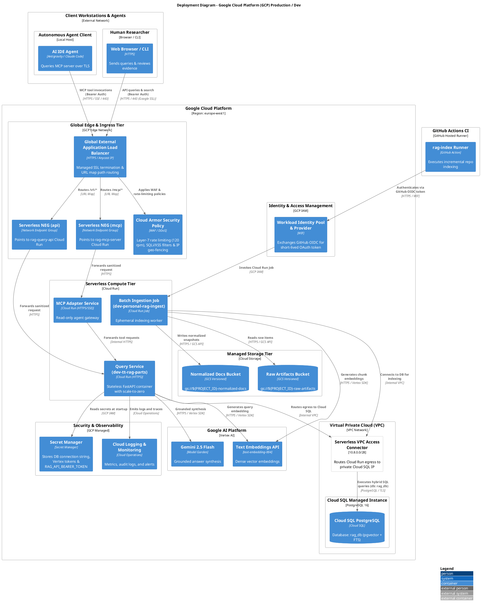
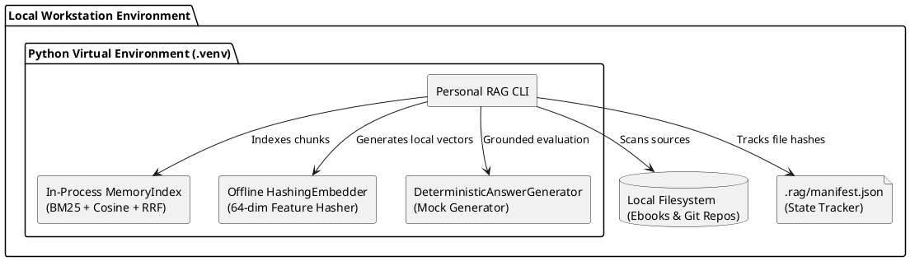

# C4 Deployment View: Local & Cloud Topologies

This document specifies the **Deployment Architecture** of the Personal Agentic RAG Platform, detailing physical node layouts, runtime environments, network isolation boundaries, and IAM role mappings.

---

## 1. Cloud Production Deployment Topology (GCP)

---

## 2. Local Development Topology

To guarantee fast feedback, zero developer cost, and hermetic offline testing, the platform provides a complete **in-process local topology**:

- **Zero Cloud Dependencies**: The local suite runs entirely offline via `pytest` and `python scripts/personal_rag_demo.py`.
- **Reference Semantics**: `MemoryIndex` implements the identical search and candidate-activation semantics as Cloud SQL `pgvector`.

---

## 3. Least-Privilege IAM Matrix

| Principal / Service Account | Assigned Roles | Bound Resources | Principle of Least Privilege Justification |
|---|---|---|---|
| **Query Service SA** (`sa-query-api`) | `roles/cloudsql.client` `roles/secretmanager.secretAccessor` `roles/aiplatform.user` `roles/logging.logWriter` | Cloud SQL instance `RAG_API_BEARER_TOKEN` & DB secrets Vertex AI project Cloud Logging | Allows read-only hybrid retrieval and grounded generation; zero storage mutation rights. |
| **Ingestion Job SA** (`sa-ingestion-job`) | `roles/cloudsql.client` `roles/storage.objectAdmin` `roles/secretmanager.secretAccessor` `roles/aiplatform.user` `roles/logging.logWriter` | Cloud SQL instance Artifact buckets (`raw`, `norm`) DB connection secret Vertex AI project | Allows batch chunk insertion and artifact persistence; isolated from public ingress. |
| **CI/CD WIF Service Account** (`sa-github-ci`) | `roles/run.invoker` `roles/run.jobsExecutor` | Cloud Run ingestion endpoint Cloud Run ingestion job | Allows triggering batch indexing jobs from verified GitHub repos without service account keys. |
| **Human Owner / Researcher** | `roles/run.invoker` | Cloud Run services | Allows direct HTTPS invocation using pre-shared Bearer token or GCP credentials. |
