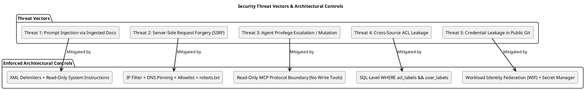

# C4 System Requirements, Assumptions & Governance

This document establishes the formal **Functional Requirements (FR)**, **Non-Functional Requirements (NFR)**, **Service Level Objectives (SLO)**, **System Assumptions**, and **Security Control Matrix** for the Personal Agentic RAG Platform.

---

## 1. Functional Requirements (FR)

### Ingestion & Connectors
- **FR-01 (Source Abstraction)**: The platform MUST ingest heterogeneous sources (PDF/EPUB, Web articles, Git trees, CI repositories) through a unified `SourceAdapter` protocol emitting canonical `DocumentVersion` and `Chunk` models.
- **FR-02 (PDF/EPUB Parsing)**: The filesystem connector MUST extract text and preserve human-verifiable page numbers (`{"page": N}`) and chapter headings (`{"chapter": "..."}`).
- **FR-03 (Web SSRF & Policy Guard)**: The web connector MUST reject private/loopback/cloud metadata IP destinations, enforce host allowlists, check `/robots.txt`, and validate redirects recursively.
- **FR-04 (Git-Aware Provenance)**: Ingested documents from Git sources MUST record the exact commit SHA, branch ref, relative path, and top-level heading.
- **FR-05 (CI/CD Repo Indexer)**: The `rag-index` CLI MUST analyze commit diffs, evaluate `.ragignore` ignore files, and publish deletion tombstones for removed files.
- **FR-06 (Idempotency)**: Re-ingesting an unchanged document MUST produce zero new embeddings, zero chunk writes, and zero cost.

### Pipeline & Chunking
- **FR-07 (Structure-Aware Chunking)**: Chunking MUST respect Markdown heading boundaries, code AST symbol boundaries, and page borders, targeting 400–800 tokens with 10–15% overlap. Headings MUST NOT be merged across sibling sections.
- **FR-08 (Enrichment)**: Every chunk MUST receive deterministic identifiers (`chunk_id`), heading breadcrumbs, source ACL labels, and language tags.
- **FR-09 (Versioned Embeddings)**: Embeddings MUST be generated via version-pinned models (`text-embedding-004`), recording model ID and dimensionality.

### Retrieval & Grounding
- **FR-10 (SQL-Level ACL Filtering)**: Source access control labels MUST be filtered directly in SQL prior to sparse and dense ranking.
- **FR-11 (Hybrid Retrieval & RRF)**: The search engine MUST execute PostgreSQL full-text search (`tsvector`) and `pgvector` cosine similarity in parallel, fusing candidate lists via Reciprocal Rank Fusion (RRF, $k=60$).
- **FR-12 (Context Budgeting)**: The query service MUST assemble evidence within a configurable token budget (e.g. 4000 tokens) with source diversity caps.
- **FR-13 (Strict Abstention)**: When retrieval confidence is below the minimum threshold or evidence is absent, the system MUST abstain immediately without invoking LLM completion.
- **FR-14 (Citation Verification)**: Generated answers MUST cite valid chunk IDs (`[chunk_id]`). Any hallucinated chunk ID MUST cause immediate rejection and fallback.

### Interfaces & Agent Integration
- **FR-15 (Read-Only MCP Server)**: The platform MUST provide a Model Context Protocol (MCP) server exposing `rag_search`, `rag_answer`, `rag_sources`, and `rag_ingestion_status` tools.
- **FR-16 (Zero Agent Mutation)**: Agent interfaces MUST NOT expose any tool capable of mutating the database, triggering ingestion, or altering ACLs.

### Index Lifecycle & Rollback
- **FR-17 (Candidate Indexing)**: Ingestion batches MUST build a `CANDIDATE` index without impacting the active serving index.
- **FR-18 (Evaluation Gate)**: A candidate index MUST pass automated retrieval recall and negative-query tests before activation.
- **FR-19 (Atomic Activation & Rollback)**: Pointer swap MUST occur in an atomic database transaction. Rollback to a previous index run MUST take under 5 seconds.

---

## 2. Non-Functional Requirements & SLO Targets (NFR)

| NFR ID | Category | Metric / Requirement | SLO Target / Threshold |
|---|---|---|---|
| **NFR-01** | **Search Latency** | `/v1/search` response time (p50 / p95) | p50 < 300 ms, p95 < 800 ms |
| **NFR-02** | **Answer Latency** | `/v1/answer` grounded synthesis time (p50 / p95) | p50 < 2.5 s, p95 < 5.0 s |
| **NFR-03** | **Availability** | Query Service API Uptime | 99.9% uptime during active hours |
| **NFR-04** | **Cost Bound (Search)** | Ingestion and Query Embedding Cost | < $0.0001 per search query |
| **NFR-05** | **Cost Bound (Answer)** | Generation Cost per Answer | < $0.005 per grounded answer |
| **NFR-06** | **Scale to Zero** | Idle Resource Cost | $0.00 compute cost when idle (Serverless Cloud Run) |
| **NFR-07** | **Citation Precision** | Correctness of citations in generated answers | $\ge$ 95% verifiable citations |
| **NFR-08** | **Negative Abstention** | Rejection rate on unsupported/negative queries | 100% abstention (zero hallucinations) |
| **NFR-09** | **Ingestion Throughput** | Batch document processing rate | $\ge$ 50 pages/sec (local parse) |
| **NFR-10** | **Rollback Time** | Emergency index reversion latency | < 5 seconds via pointer swap |
| **NFR-11** | **Telemetry Privacy** | Log redaction | 0% query text or document bodies in plain logs |
| **NFR-12** | **Secret Sanitization** | Static credentials in code or repository | 0 hardcoded keys, passwords, or emails |

---

## 3. System Assumptions & Operating Constraints

1. **Single Primary Owner with Compartmentalized Access**:
   - The platform is designed for a primary researcher/owner with capability-based ACL labels (`private`, `shared`, `public`) to support controlled agent sharing.
2. **Deterministic Retrieval Precedence**:
   - High-precision deterministic search and strict grounded generation are prioritized over autonomous, multi-turn agent exploration.
3. **PostgreSQL as Consolidated Datastore**:
   - Cloud SQL PostgreSQL 16 with `pgvector` and `tsvector` satisfies both relational metadata and hybrid search requirements up to 1,000,000 chunks without requiring a separate standalone vector database.
4. **Untrusted Evidence Isolation**:
   - Retrieved text from third-party websites or external repositories is treated as potentially adversarial; LLM prompts delimit evidence and forbid tool execution.
5. **Hermetic Local Development**:
   - The local codebase must remain 100% testable offline via `pytest` without requiring active GCP credentials or incurring billing costs.

---

## 4. Security Threat Model & Control Matrix

| Threat Vector | STRIDE Category | Enforcement Point | Technical Architectural Control |
|---|---|---|---|
| **Prompt Injection** | Elevation of Privilege | Generator Boundary | Retrieved chunks are delimited as untrusted XML data; generation prompt instructs the model to ignore any embedded directives. |
| **Web Connector SSRF** | Information Disclosure | Web Adapter Engine | Socket-level IP validation blocks private IPs (`10.0.0.0/8`, `127.0.0.0/8`, `169.254.169.254`); DNS is validated pre-request; redirects are checked recursively. |
| **Agent Corpus Mutation** | Tampering | MCP Server Boundary | MCP server provides only read-only search/answer tools; zero endpoints or tools exist for deletion or database writing. |
| **Unauthorized Evidence Retrieval** | Information Disclosure | SQL Database Layer | ACL labels are filtered directly in PostgreSQL `WHERE` clauses prior to ranking, making unauthorized chunks invisible to retrieval. |
| **Credential & Identity Leakage** | Information Disclosure | CI/CD & Terraform | No static service account keys; authentication uses keyless Workload Identity Federation (WIF) and Secret Manager; git history is sanitized. |
| **Stale or Invalid Index Activation** | Denial of Service / Integrity | Ingestion Pipeline | Candidate indexes must clear automated negative and golden evaluation gates before the active index pointer is atomically swapped. |
