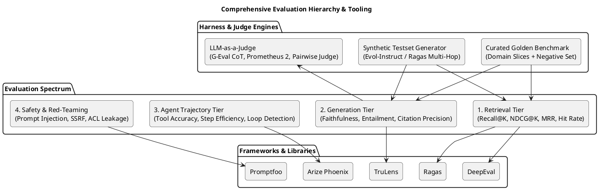
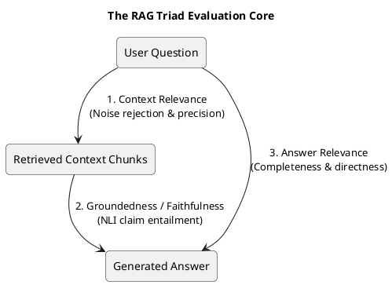

# C4 Architecture Specification: RAG & Agent Evaluation Spectrum

> **Document ID**: `09-rag-and-agent-evaluations`  
> **Status**: Approved Architectural Standard  
> **Scope**: Exhaustive evaluation metrics, frameworks, libraries, LLM-as-a-Judge methodologies, and agent trajectory benchmarks for the Personal RAG Platform.

---

### 1. Comprehensive Evaluation Hierarchy

The platform implements a multi-tiered evaluation harness that evaluates retrieval, generation, groundedness, and agent behavior independently before activating any index or service deployment.



---

## 2. Metric Specifications

### 2.1 Retrieval Tier Metrics

| Metric | Formula / Definition | Target Threshold | Purpose |
|---|---|---|---|
| **Recall@K** | $\frac{|\text{Relevant Chunks Retrieved in Top } K|}{|\text{Total Relevant Chunks in Ground Truth}|}$ | $\ge 0.90$ ($K=8$) | Ensures all necessary evidence is retrieved. |
| **Precision@K** | $\frac{|\text{Relevant Chunks in Top } K|}{K}$ | $\ge 0.70$ ($K=8$) | Minimizes noise entering the context window. |
| **MRR (Mean Reciprocal Rank)** | $\frac{1}{|Q|} \sum_{i=1}^{|Q|} \frac{1}{\text{rank}_i}$ | $\ge 0.85$ | Evaluates how close the first relevant chunk is to the top rank. |
| **NDCG@K** | $\frac{\text{DCG}_K}{\text{IDCG}_K} = \frac{\sum_{i=1}^K \frac{2^{rel_i}-1}{\log_2(i+1)}}{\text{IDCG}_K}$ | $\ge 0.88$ ($K=8$) | Evaluates graded relevance and ranking quality. |
| **Hit Rate@K** | Fraction of queries where at least 1 relevant chunk is in Top $K$. | $\ge 0.98$ | Verifies zero complete retrieval misses. |
| **Context Relevance** | Ratio of retrieved sentences directly pertinent to the question. | $\ge 0.85$ | Calculated via LLM-as-a-Judge sentence extraction. |

---

### 2.2 Generation & Grounding Metrics (The RAG Triad)



1. **Faithfulness / Groundedness (NLI Entailment)**:
   - Evaluates if every factual claim in the generated answer is strictly entailed by the retrieved context.
   - **Methodology**: Claims are parsed into atomic propositions; each proposition is checked via Natural Language Inference (NLI) classification (`Entailment`, `Neutral`, `Contradiction`).
   - **Target**: $\ge 0.98$ (zero ungrounded claims).
2. **Answer Relevance**:
   - Assesses whether the generated response directly answers the prompt without digression.
   - **Target**: $\ge 0.90$.
3. **Citation Precision & Recall**:
   - **Citation Precision**: $\frac{|\text{Valid Citing Chunks that Support the Claim}|}{|\text{Total Citations Inserted by LLM}|} = 1.0$ (100% precision required).
   - **Citation Recall**: $\frac{|\text{Supported Claims with Citations}|}{|\text{Total Claims}|} \ge 0.95$.
4. **Strict Negative Abstention Precision**:
   - Rate of graceful refusal on queries where the context does not contain the answer.
   - **Target**: **100%** (zero hallucinated answers on negative/adversarial test cases).

---

### 2.3 Agent Trajectory & Behavior Evaluation Metrics

For autonomous AI agents interacting with the knowledge platform:

| Agent Metric | Measurement Technique | Failure Mode Detected | Target Threshold |
|---|---|---|---|
| **Tool Selection Accuracy** | Exact match vs. expected tool in single/multi-step intent test | Wrong tool called (e.g. calling search instead of answer) | $\ge 0.98$ |
| **Argument Grounding** | Parameter validation against schema & conversation history | Fabricated or hallucinated filter names or source IDs | $\ge 0.99$ |
| **Trajectory Step Efficiency** | $\frac{\text{Optimal Step Count}}{\text{Actual Executed Steps}}$ | Tool thrashing, redundant queries, excessive latency | $\ge 0.80$ |
| **Loop & Oscillation Rate** | Graph cycle detection on agent state transitions $(Tool_A \rightarrow Tool_B \rightarrow Tool_A)$ | Agent getting trapped in retry loops | **0.0%** (Zero tolerance) |
| **State Drift & Goal Retention** | Semantic cosine similarity between Initial Objective and Final Sub-goal | Agent wandering off topic during multi-step tasks | $\ge 0.85$ |
| **ACL Guardrail Evasion Resistance** | Red-teaming prompts attempting unauthorized source lookups | Information leakage from private to shared contexts | **100% Blocked** |

---

## 3. Evaluation Frameworks & Tooling Matrix

The platform integrates a curated matrix of industry-leading open-source libraries:

| Library / Tool | Primary Evaluation Functionality | Integration Hook |
|---|---|---|
| **`Ragas`** | Standardized RAG Triad computation, Context Precision/Recall, Faithfulness, Aspect Critique. | Invoked in CI evaluation gate (`evals/run_eval.py`). |
| **`DeepEval`** | Unit-testing for LLMs, G-Eval implementation, hallucination metrics, assert-based CI assertions. | Unit/Integration test suites (`pytest tests/evals/`). |
| **`TruLens`** | Feedback functions, RAG Triad instrumentation, latency and cost tracking. | Embedded in local development and batch run profiling. |
| **`Promptfoo`** | Red-teaming, prompt regression testing, SSRF injection, adversarial jailbreak probing. | Automated security regression scans. |
| **`Arize Phoenix`** | OpenTelemetry-native trace visualization, span-level evaluation, agent trajectory tracking. | Query service OpenTelemetry exporter. |
| **`Tonic Validate`** | Automated calculation of answer similarity, context recall, and augmented generation metrics. | Candidate index evaluation reports. |
| **`Cleanlab Studio`** | Automated detection of noisy, contradictory, or duplicate documents in the raw corpus. | Ingestion pre-filtering and corpus sanitization. |

---

## 4. LLM-as-a-Judge Architectures

```plantuml
@startuml "09-llm-judge-workflow"
skinparam componentStyle rectangle
skinparam roundCorner 10

title LLM-as-a-Judge Evaluation Workflow (G-Eval / CoT)

[Input: (Query, Retrieved Context, Generated Answer, Ground Truth)] as INPUT

package "Chain-of-Thought (G-Eval) Rubric" {
    [Step 1: Extract Atomic Factual Claims from Answer] as STEP1
    [Step 2: Find Supporting Sentences in Context] as STEP2
    [Step 3: Evaluate Entailment (Entailed / Neutral / Contradict)] as STEP3
    [Step 4: Check Citations (Valid chunk_id / Invalid)] as STEP4
    [Step 5: Score [1-5] with Explicit Chain-of-Thought Reasoning] as STEP5
}

[Pairwise Comparative Judge\n(Candidate Model vs Baseline, Order Swapped)] as PAIRWISE
[Specialized Judge Model\n(Prometheus 2 / Llama-3-70B-Instruct)] as SPEC_JUDGE

INPUT --> STEP1
STEP1 --> STEP2
STEP2 --> STEP3
STEP3 --> STEP4
STEP4 --> STEP5

INPUT --> PAIRWISE
INPUT --> SPEC_JUDGE

@enduml
```

### 4.1 G-Eval (Chain-of-Thought Rubric Scoring)
Rather than asking an LLM for an arbitrary score, G-Eval breaks evaluation into structured steps:
1. **Rubric Definition**: Define clear criteria for scores 1 through 5.
2. **Step Generation**: The judge model generates an explicit reasoning chain before scoring.
3. **Probability Normalization**: Token probabilities of the numeric score tokens are weighted to compute a continuous, calibrated score.

### 4.2 Pairwise Comparative Judging with Bias Mitigation
- Compares candidate index answers against the baseline active index.
- **Position Bias Mitigation**: Evaluates each pair twice, swapping order ($A \text{ vs } B$ and $B \text{ vs } A$). If the judge favors the first position inconsistently, the sample is flagged as inconclusive.
- **Verbosity Bias Mitigation**: Evaluates answers with strict length normalization.

### 4.3 Specialized Open Judge Models
- Supports hosting **Prometheus 2** (fine-tuned specifically for fine-grained evaluation rubrics) or **Llama-3-70B-Instruct** hosted on Vertex AI to perform zero-leakage, local offline judging.

---

## 5. Dataset Generation & Continuous Evaluation

### 5.1 Synthetic Multi-Hop Dataset Generation (Evol-Instruct)
- Uses `Ragas` and `DeepEval` synthetic testset generators to transform raw corpus chunks into:
  - **Single-hop factual questions**: Direct retrieval against a single chunk.
  - **Multi-hop reasoning questions**: Questions requiring evidence synthesis across two distinct documents/chapters.
  - **Adversarial / Negative questions**: Questions about topics intentionally omitted from the corpus to test abstention.

### 5.2 Golden Dataset Composition

| Corpus Slice | Golden Set Size | Negative Set Size | Adversarial / Injection Set Size |
|---|---|---|---|
| **Ebooks (PDF/EPUB)** | 50 queries | 20 queries | 10 queries |
| **Web Technical Articles** | 40 queries | 15 queries | 10 queries |
| **`tt-root/info` Reference** | 50 queries | 20 queries | 10 queries |
| **Project Code Repositories** | 40 queries | 15 queries | 10 queries |
| **Total Test Suite** | **180 queries** | **70 queries** | **40 queries** |

### 5.3 Production Shadow Evaluation & Feedback Loop
- **Asynchronous Shadow Evaluation**: 5% of live production queries are sampled asynchronously.
- The query, context, and answer are evaluated by the background judge worker.
- Drift in retrieval scores or citation precision triggers immediate alerts in Cloud Monitoring.
