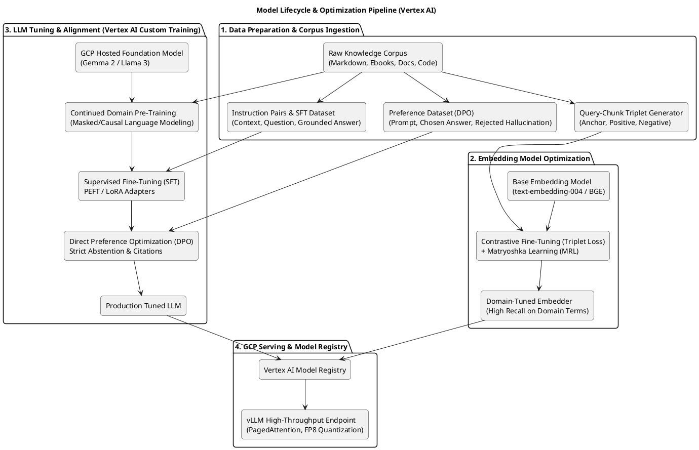
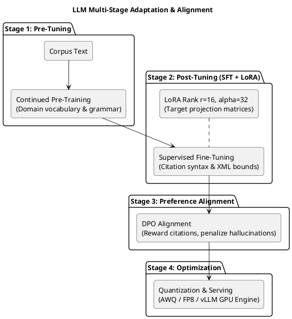

# C4 Architecture Specification: GCP Model Optimization & Tuning Pipelines

> **Document ID**: `10-model-optimization-and-tuning`  
> **Status**: Approved Architectural Standard  
> **Scope**: Continued pre-training, SFT with LoRA/PEFT, DPO alignment, embedding contrastive fine-tuning, and high-performance serving on Google Cloud Platform (GCP).

---

## 1. Model Lifecycle & Optimization Pipeline

The platform supports end-to-end model optimization on Google Cloud Vertex AI, covering embedding model adaptation, LLM supervised fine-tuning (SFT), parameter-efficient fine-tuning (PEFT/LoRA), and direct preference alignment.

---

## 2. Embedding Model Optimization

### 2.1 Contrastive Learning with Triplet Loss
To maximize retrieval recall on specialized technical terminology, canonical notes, and vehicle part codes, base embeddings are fine-tuned using Multiple Negatives Ranking (MNR) and Triplet Loss:

$$\mathcal{L}_{\text{triplet}} = \max\left(0, \mathcal{D}(\mathbf{e}_a, \mathbf{e}_p) - \mathcal{D}(\mathbf{e}_a, \mathbf{e}_n) + \alpha\right)$$

Where:
- $\mathbf{e}_a$: Anchor query embedding.
- $\mathbf{e}_p$: Positive (relevant) context chunk embedding.
- $\mathbf{e}_n$: Hard negative (irrelevant or superficially similar) chunk embedding.
- $\alpha$: Distance margin parameter ($\alpha = 0.2$).

### 2.2 Matryoshka Representation Learning (MRL)
Embeddings are trained using Matryoshka loss, enabling nested vector representations:
- **Full Vector (768 dimensions)**: Stored in Cloud SQL for deep retrieval and high-precision evaluation.
- **Truncated Vector (256 or 128 dimensions)**: Used for rapid in-memory pre-filtering and low-latency cache lookups with less than 1.5% loss in Mean Reciprocal Rank (MRR).

---

## 3. LLM Fine-Tuning & Adaptation Strategies

### 3.1 Continued Domain Pre-Training (Pre-Tuning)
- **Objective**: Adapt base tokenizers and self-attention layers to proprietary nomenclature, architecture documentation, and codebase syntax before instruction tuning.
- **Training Setup**: Vertex AI Custom Training Job utilizing PyTorch Distributed Data Parallel (DDP) on NVIDIA L4 or A100 GPUs.

### 3.2 Supervised Fine-Tuning (SFT) with LoRA / QLoRA
- **Base Models**: Google Gemma 2 (9B / 27B) or Llama 3 (8B / 70B) hosted in Vertex AI Model Garden.
- **LoRA Configuration**:
  - Rank ($r$): 16
  - Scaling factor ($\alpha$): 32
  - Target Modules: `q_proj`, `k_proj`, `v_proj`, `o_proj`, `gate_proj`, `up_proj`, `down_proj`.
  - LoRA Dropout: 0.05
- **Task Objectives**:
  1. **Grounding Adherence**: Strictly restrict answers to information present within `<evidence>` tags.
  2. **Citation Syntax**: Deterministically output bracketed `[chunk_id]` citations immediately following supported claims.
  3. **Structured Tool Formatting**: Emit valid JSON tool arguments when operating under agent boundaries.

### 3.3 Direct Preference Optimization (DPO) (Post-Tuning)
- Replaces complex RLHF reward modeling with direct closed-form loss optimization:

$$\mathcal{L}_{\text{DPO}}(\theta; \pi_{\text{ref}}) = -\mathbb{E}_{(x, y_w, y_l)} \left[ \log \sigma \left( \beta \log \frac{\pi_\theta(y_w|x)}{\pi_{\text{ref}}(y_w|x)} - \beta \log \frac{\pi_\theta(y_l|x)}{\pi_{\text{ref}}(y_l|x)} \right) \right]$$

- **Winning Pair ($y_w$)**: Grounded answer citing valid chunk IDs, or an explicit graceful abstention when context is insufficient.
- **Losing Pair ($y_l$)**: Ungrounded answer, hallucinated citation identifier, or answering despite absent evidence.

---

## 4. Model Serving & Inference Optimization on GCP

| Optimization Technique | Implementation Mechanism | Benefit / SLO Impact |
|---|---|---|
| **vLLM Engine** | PagedAttention memory management | 3x–5x higher serving throughput, zero KV-cache fragmentation. |
| **Quantization (AWQ / FP8)** | Activation-aware 4-bit/8-bit weight quantization | 50% reduction in GPU VRAM requirements; sub-50ms Time-To-First-Token (TTFT). |
| **Vertex AI Model Registry** | Versioned artifact and container deployment | Seamless traffic splitting (canary releases) and instant rollback to prior model versions. |
| **Cloud Run GPU Serving** | Containerized vLLM on Cloud Run with NVIDIA L4 | Automatic scale-to-zero during off-hours, eliminating idle GPU hourly costs. |
| **Continuous Batching** | Dynamic iteration-level batching | Optimal GPU utilization under fluctuating query concurrency. |
