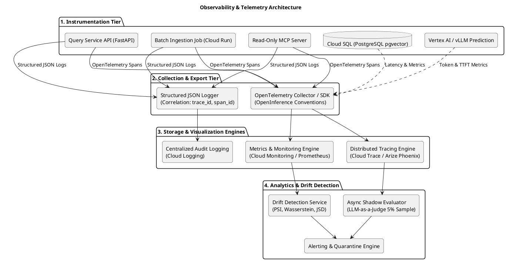
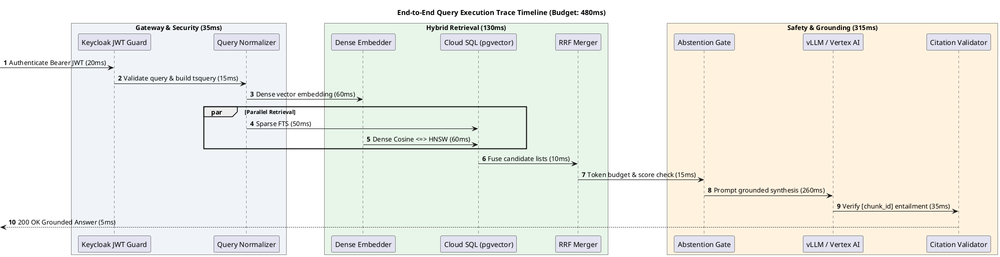
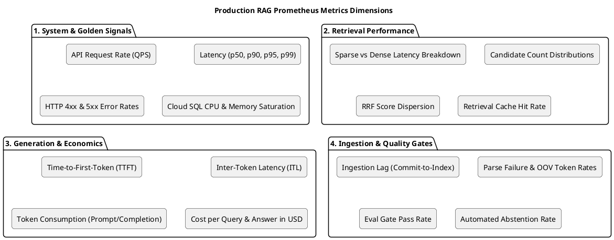
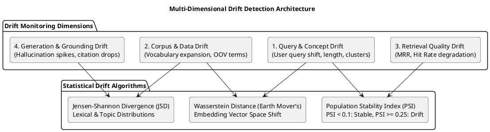
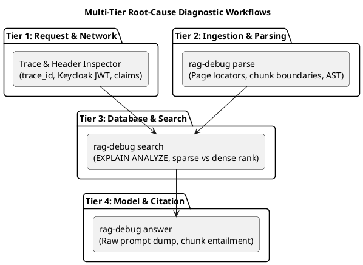
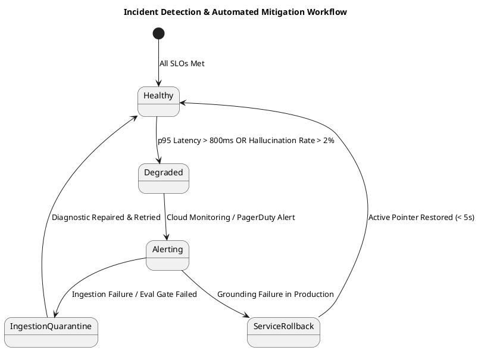

# C4 Architecture Specification: Monitoring, Observability & Drift Detection

> **Document ID**: `11-monitoring-and-observability`  
> **Status**: Approved Architectural Standard  
> **Scope**: End-to-end distributed tracing, production RAG performance telemetry, multi-dimensional drift detection, and multi-tier root-cause debugging tooling.

---

## 1. Observability Architecture Overview

The platform implements a comprehensive, OpenTelemetry-native observability layer providing full visibility across the query lifecycle, batch ingestion jobs, vector databases, model inference, and autonomous agent tool calls.



---

## 2. Distributed Tracing & Span Taxonomy (OpenInference)

To enable sub-millisecond root-cause debugging, all request execution paths are traced using **OpenInference** semantic conventions for Generative AI and RAG applications.

### 2.1 Trace Timeline & Span Hierarchy



### 2.2 Standard OpenInference Span Attributes

| Span Name | Type | Key Metadata Attributes Captured |
|---|---|---|
| `rag.query.request` | Root Server | `http.method`, `http.status_code`, `user.id`, `user.acl_labels`, `rag.query.text_length` |
| `rag.retrieval.dense_embed` | Embedder | `embedding.model_name`, `embedding.dimensions`, `embedding.token_count`, `latency_ms` |
| `rag.retrieval.sql_hybrid` | Database | `db.system=postgresql`, `db.operation=hybrid_rrf`, `retrieval.sparse_count`, `retrieval.dense_count`, `retrieval.fused_count` |
| `rag.evidence.budget` | Processing | `evidence.total_tokens`, `evidence.chunk_count`, `evidence.source_distribution` |
| `rag.generation.llm` | LLM | `llm.model_name`, `llm.temperature`, `llm.prompt_tokens`, `llm.completion_tokens`, `llm.ttft_ms`, `llm.cost_usd` |
| `rag.grounding.citation_check`| Guardrail | `grounding.citations_found`, `grounding.citations_valid`, `grounding.entailment_passed` |
| `mcp.tool.execute` | Agent Tool | `mcp.tool_name`, `mcp.caller_agent`, `mcp.arguments_hash`, `mcp.is_mutation=false` |

---

## 3. Production RAG Metrics Catalog

The system continuously collects and exposes high-cardinality Prometheus metrics across four core dimensions:



### 3.1 Detailed Metrics Reference Table

| Metric Name | Type | Unit | Collection | Alerting Threshold / SLO |
|---|---|---|---|---|
| `rag_query_latency_seconds` | Histogram | Seconds | Real-time | p50 < 0.3s, p95 < 0.8s, p99 < 1.5s |
| `rag_llm_ttft_seconds` | Histogram | Seconds | Real-time | p50 < 0.25s, p95 < 0.6s |
| `rag_retrieval_candidate_count` | Histogram | Chunks | Real-time | Range: 10–50 chunks |
| `rag_retrieval_rrf_top_score` | Gauge | Score [0-1]| Real-time | Min score floor $\ge 0.016$ |
| `rag_grounding_citation_validity_ratio` | Gauge | Ratio [0-1]| Per Request| 1.0 (100% valid citations required) |
| `rag_abstention_rate` | Counter | Ratio | 1-min rollup| Monitored for anomalous spikes (> 25%) |
| `rag_token_cost_usd_total` | Counter | USD | Hourly | Daily cost ceiling alert at $5.00/day |
| `rag_ingestion_lag_seconds` | Gauge | Seconds | Ingestion run| < 120s from commit to candidate index |
| `rag_ingestion_parse_error_total` | Counter | Count | Ingestion run| > 0 errors triggers manual review |
| `rag_sql_pool_exhaustion_count` | Counter | Count | Real-time | 0 pool exhaustion events |

---

## 4. Multi-Dimensional Drift Detection Architecture

Drift in RAG systems leads to degraded retrieval recall, ungrounded answers, and model hallucinations. The platform monitors four distinct drift dimensions:



### 4.1 Query & Concept Drift
- **Mechanism**: Calculates the Population Stability Index (PSI) and Wasserstein Distance between the 768-dimensional embedding distribution of the baseline query set ($P$) and the rolling 7-day query window ($Q$):

$$\text{PSI} = \sum_{b=1}^B \left( Q_b - P_b \right) \times \ln\left( \frac{Q_b}{P_b} \right)$$

- **Thresholds**:
  - $\text{PSI} < 0.1$: Distribution is stable; no action required.
  - $0.1 \le \text{PSI} < 0.25$: Moderate drift; log warning and trigger shadow evaluation.
  - $\text{PSI} \ge 0.25$: Significant concept drift; triggers alert to evaluate retrieval recall and update golden query benchmarks.

### 4.2 Corpus & Data Drift
- Monitors **Vocabulary Expansion Rate** and **Out-Of-Vocabulary (OOV)** ratios during ingestion.
- If a new ingestion batch introduces $> 5\%$ novel domain terms not captured in the base embedding vocabulary, a retraining trigger is logged.

### 4.3 Retrieval Quality Drift
- **Daily Shadow Evaluation**: Asynchronously replays 50 curated golden benchmark queries against the active index every 24 hours.
- Tracks daily Mean Reciprocal Rank (MRR) and Hit Rate@K. A drop in MRR $> 5\%$ triggers an automated alert.

### 4.4 Generation & Hallucination Drift
- Samples 5% of live queries and evaluates them with the asynchronous LLM-as-a-Judge.
- Tracks the rolling **Hallucination Rate** and **Citation Precision**. Any drop in citation precision below 95% triggers an immediate engineering alert.

---

## 5. Multi-Tier Root-Cause Debugging Tooling

To diagnose and resolve issues at any level of the stack, the platform provides dedicated debugging tools and workflows:



### 5.1 The `rag-debug` Interactive Diagnostic CLI

The platform ships with a CLI utility (`rag-debug`) for developers and operators:

#### 1. Inspect Document Chunking & Locators
```bash
python -m personal_rag.debug.cli parse \
  --file "ebooks/reference.pdf" \
  --page 42 \
  --show-tokens
```
*Output*: Displays exact extracted text, heading ancestry, token counts, and generated `locator_json`.

#### 2. Simulate & Deconstruct Hybrid Retrieval
```bash
python -m personal_rag.debug.cli search \
  --query "pgvector HNSW index parameters" \
  --source-ids "ebooks,tt-root-info" \
  --explain-sql
```
*Output*: Prints:
- Dense embedding vector norm and cosine distance to nearest 5 chunks.
- PostgreSQL `EXPLAIN (ANALYZE, BUFFERS)` execution plan.
- Separate sparse (BM25) and dense ranking lists before and after RRF fusion ($k=60$).

#### 3. Replay & Deconstruct Grounded Answer Generation
```bash
python -m personal_rag.debug.cli answer \
  --trace-id "4bf92f3577b34da6a3ce929d0e0e4736" \
  --verbose-grounding
```
*Output*: Fetches the exact historical prompt, context budget, raw LLM completion, and provides step-by-step NLI entailment proofs for each cited chunk.

---

## 6. Alerting Policies & Incident Response Workflows



| Incident Type | Trigger Condition | Automated Action | Operator Action |
|---|---|---|---|
| **P1: Citation Failure Spike** | Citation validity $< 95\%$ over 5-min window | Service enters strict abstention mode for low-confidence queries | Inspect prompt template & judge logs; rollback LLM version if needed |
| **P2: Latency SLO Breach** | p95 latency $> 1.5\text{s}$ for 10 minutes | Autoscaler spins up additional Cloud Run instances | Inspect Cloud SQL CPU and pgvector HNSW index cache hits |
| **P3: Candidate Eval Gate Failure** | Ingestion run recall $< 90\%$ or negative query answered | Ingestion run automatically marked `QUARANTINED` | Review evaluation diff via `rag-debug`; active serving is unaffected |
| **P4: High Ingestion Lag** | Freshness lag $> 30$ minutes | Cloud Run Job retry triggered with exponential backoff | Inspect source repository connectivity or API quota limits |
