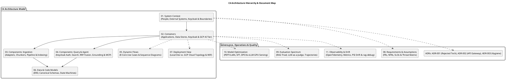

# C4 Architecture Specification & Design

> **Platform**: Personal Agentic Retrieval-Augmented Generation (RAG) Platform & GPC Pilot  
> **Status**: Approved Specification & Architecture Reference  
> **Standard**: [C4 Model for Visualising Software Architecture](https://c4model.com/)  
> **Repository Boundary**: `tt-agents-agentic-RAG`

---

## 1. Executive Summary

This directory contains the formal architectural specification for the **Personal Agentic RAG Platform**, structured according to the **C4 Model** (Context, Containers, Components, and Code/Data), augmented with security, comprehensive evaluation, model optimization, drift detection, and architecture decision records.

The platform delivers a production-grade, multi-source, privacy-first Retrieval-Augmented Generation system deployed on Google Cloud Platform (GCP). It turns diverse knowledge sources (books, web articles, canonical personal notes from `tt-root/info`, and active Git repositories) into versioned, grounded, and policy-filtered retrieval artifacts, secured via Keycloak IAM, monitored via OpenTelemetry, and accessible to human researchers and autonomous AI agents via read-only interfaces.

---

## 2. Document Map & Reading Guide

| Document | C4 Level / Scope | Description |
|---|---|---|
| [`01-system-context.md`](01-system-context.md) | **Level 1: System Context** | High-level actors (Researcher, Developer, AI Agents, CI), Keycloak IAM, external systems (Vertex AI, GitHub, Web, `tt-root/info`), and core trust boundaries. |
| [`02-containers.md`](02-containers.md) | **Level 2: Containers** | High-level architectural building blocks: Cloud Run API, Ingestion Jobs, Cloud Storage Buckets, Cloud SQL PostgreSQL (`pgvector`), Keycloak Server, and GCP Hosted Model Endpoints (`vLLM`). |
| [`03-components-ingestion.md`](03-components-ingestion.md) | **Level 3: Components (Ingestion)** | Deep dive into the ingestion pipeline: source adapters (Filesystem, Web with SSRF guard, GitTree, RepoCI), normalizer, structure-aware chunkers, enrichers, and manifest publishers. |
| [`04-components-query.md`](04-components-query.md) | **Level 3: Components (Query & Agent)** | Deep dive into the query pipeline: Keycloak JWT verification, hybrid search (sparse FTS + dense `pgvector`), Reciprocal Rank Fusion (RRF), SQL-level ACL filtering, grounded generator, citation validator, and MCP tool adapter. |
| [`05-dynamic-flows.md`](05-dynamic-flows.md) | **Dynamic View (Use Cases)** | Comprehensive sequence diagrams for 8 core scenarios (Ebook ingest, Web ingest, Git sync, CI push, Hybrid search, Grounded Q&A, MCP tool invocation, Index candidate activation & rollback). |
| [`06-data-and-code.md`](06-data-and-code.md) | **Level 4: Data & Code** | Relational database Entity-Relationship Diagram (ERD), JSON schema contracts, locator structures, and document/ingestion lifecycle state machines. |
| [`07-deployment.md`](07-deployment.md) | **Deployment View** | Physical infrastructure mapping: Local Developer Environment vs. GCP Cloud Production/Dev Infrastructure, Workload Identity Federation (WIF), and IAM least-privilege matrix. |
| [`08-requirements-assumptions.md`](08-requirements-assumptions.md) | **Requirements & Governance** | Comprehensive Functional Requirements (FR-01 to FR-19), Non-Functional Requirements (NFR-01 to NFR-12), Operating Assumptions, and STRIDE Security Control Matrix. |
| [`09-rag-and-agent-evaluations.md`](09-rag-and-agent-evaluations.md) | **Deep Dive: Evaluation Spectrum** | Exhaustive RAG Triad, Retrieval Metrics (NDCG, MRR, Hit Rate), Generation Metrics (Faithfulness, Citation Precision), Agent Trajectory Metrics (Tool accuracy, loops, drift), Frameworks (`Ragas`, `DeepEval`, `TruLens`, `Promptfoo`, `Phoenix`), and LLM-as-a-Judge (G-Eval, Prometheus 2). |
| [`10-model-optimization-and-tuning.md`](10-model-optimization-and-tuning.md) | **Deep Dive: GCP Model Tuning** | Continued domain pre-training, SFT with PEFT/LoRA/QLoRA on open-weights models (Gemma 2, Llama 3), Direct Preference Optimization (DPO), embedding contrastive fine-tuning (Triplet Loss, Matryoshka), and `vLLM` GPU prediction serving. |
| [`11-monitoring-and-observability.md`](11-monitoring-and-observability.md) | **Deep Dive: Observability & Drift** | OpenTelemetry/OpenInference distributed tracing, production metrics catalog, multi-dimensional drift detection (PSI, Wasserstein Distance, Jensen-Shannon), and `rag-debug` root-cause debugging CLI. |
| [`../adr/0001-rejected-technologies.md`](../adr/0001-rejected-technologies.md) | **ADR-001: Rejected Technologies** | Dedicated analysis documenting all rejected technologies (Pinecone, Qdrant, Weaviate, LangChain, LlamaIndex, AutoGen, Auth0, Elasticsearch, Celery, closed SaaS evals) and trade-off rationale. |
| [`../adr/0002-api-gateway-and-ingress-architecture.md`](../adr/0002-api-gateway-and-ingress-architecture.md) | **ADR-002: API Gateway & Ingress** | Selection of Cloud Application Load Balancer & Cloud Armor WAF for edge routing, SSL termination, and rate limiting. |
| [`../adr/0003-public-repository-hygiene-and-identity-sanitization.md`](../adr/0003-public-repository-hygiene-and-identity-sanitization.md) | **ADR-003: Repository Hygiene & Zero-Leak** | Standards for identity redaction, generic placeholders, and specification immutability. |

---

## 3. Core Architectural Principles

1. **Sources are Adapters, Not Query-Time Special Cases**:
   - Every input connector (PDF/EPUB, Web, Git tree, CI/CD) produces identical canonical `DocumentVersion` and `Chunk` records. The retrieval engine is completely decoupled from ingestion formats.
2. **Immutable Raw Inputs & Versioned Artifacts**:
   - Source re-ingestion never mutates history in place; it registers a new document version identified by content hash and creates candidate index runs.
3. **Retrieval is Policy-Aware at the Database Layer**:
   - Access control labels (ACLs) provided by Keycloak JWT tokens are enforced in SQL before sparse/dense candidate ranking, preventing unauthorized evidence from entering model prompts.
4. **Evidence is Untrusted Data**:
   - Retrieved text is strictly delimited and treated as untrusted payload. It cannot trigger tools, grant authorizations, or override system prompt safety instructions.
5. **Rebuildable Candidate Indexes with Atomic Activation**:
   - Ingestion builds a candidate index evaluated against negative and golden test sets before an atomic pointer swap activates it. Rollback immediately points back to the prior stable index.
6. **Strict Separation of Read and Write Boundaries**:
   - External querying agents access the system exclusively via a read-only Model Context Protocol (MCP) server over HTTPS. Agents have zero direct database access and zero ingestion or mutation permissions.
7. **End-to-End Observability & Continuous Drift Detection**:
   - OpenTelemetry span instrumentation, high-cardinality performance metrics, and statistical drift monitoring (PSI) ensure transparent operation and rapid incident triage.
