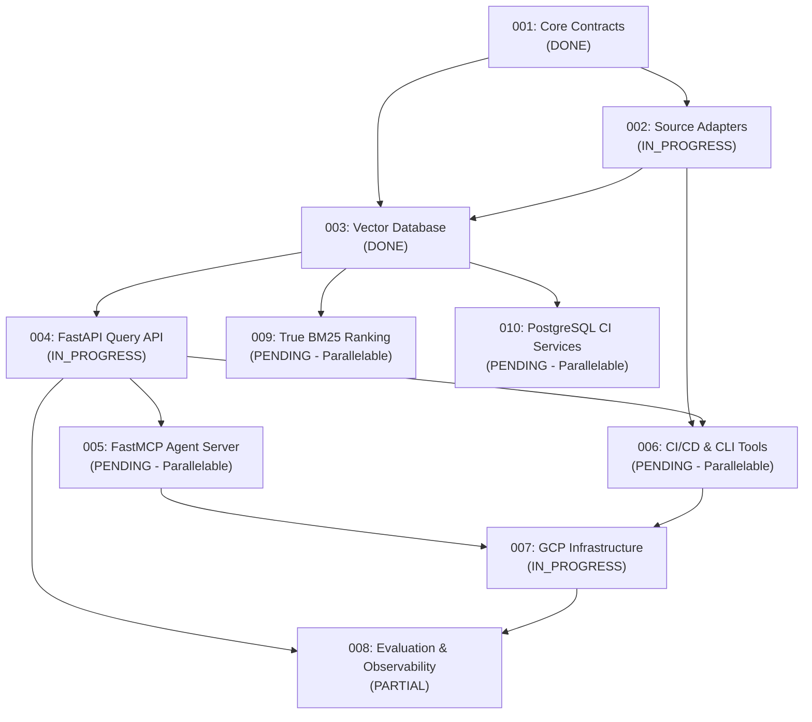

# Master Implementation Plan — Modular Section Assembly

This is the master assembly document for the **Personal Agentic RAG Platform** implementation plan. It coordinates and links the independent, decoupled modular section plans located in [`docs/implementation/`](file:///d:/src/tt-agents-agentic-RAG.gh.public.git/docs/implementation/).

---

## 1. Master Section Assembly Matrix

| Section ID & Title | Status | Assigned Subagent | Upstream Dependencies | Primary Target Files | Section Document Link |
|---|---|---|---|---|---|
| **001: Core Contracts & Data Models** | `DONE` | `self` | None | `src/personal_rag/models.py`, `errors.py` | [`001-section-contracts-and-models.md`](001-section-contracts-and-models.md) |
| **002: Source Adapters & Normalization** | `IN_PROGRESS` | `research` / Ingestion Agent | `001` | `src/personal_rag/sources/`, `pipeline/` | [`002-section-source-adapters.md`](002-section-source-adapters.md) |
| **003: Database & Vector Store** | `DONE` | Database Agent | `001`, `002` | `src/personal_rag/index/postgres.py`, `db/` | [`003-section-database-and-vector-store.md`](003-section-database-and-vector-store.md) |
| **004: FastAPI Query Service & Auth** | `IN_PROGRESS` | API Agent | `003` | `src/personal_rag/query/`, `api/` | [`004-section-fastapi-query-service.md`](004-section-fastapi-query-service.md) |
| **005: Read-Only FastMCP Agent Server** | `PENDING` | Agent Integration Subagent | `004` | `src/personal_rag/mcp/` | [`005-section-fastmcp-agent-server.md`](005-section-fastmcp-agent-server.md) |
| **006: CI/CD Indexer & CLI Tools** | `PENDING` | CLI & Tooling Agent | `002`, `004` | `src/personal_rag/cli.py`, `rag-index` | [`006-section-ci-cd-and-cli-tools.md`](006-section-ci-cd-and-cli-tools.md) |
| **007: GCP Infrastructure & OpenTofu** | `IN_PROGRESS` | Infrastructure Agent | `001` through `006` | `deployment/gcp/` | [`007-section-deployment-and-infrastructure.md`](007-section-deployment-and-infrastructure.md) |
| **008: Evaluation Spectrum & Observability** | `PARTIAL` | Quality & Telemetry Agent | `004`, `007` | `evals/`, `src/personal_rag/telemetry/` | [`008-section-evaluation-and-observability.md`](008-section-evaluation-and-observability.md) |
| **009: True BM25 Lexical Ranking** | `PENDING` | Database Agent | `003` | `src/personal_rag/index/postgres.py`, `db/migrations/` | [`009-section-bm25-lexical-ranking.md`](009-section-bm25-lexical-ranking.md) |
| **010: PostgreSQL Integration Tests in CI** | `PENDING` | CLI & Tooling Agent | `003` | `.github/workflows/ci.yml` | [`010-section-integration-test-services.md`](010-section-integration-test-services.md) |

---

## 2. Decoupled Subagent Concurrency Strategy

The implementation plan is intentionally partitioned into modular section files to support concurrent subagent execution:

- **Independent Execution**: Subagents operating on parallel branches (e.g. `005: FastMCP Agent Server` vs `006: CI/CD Indexer`) can execute concurrently without file lock conflicts.
- **Explicit Interfaces**: Upstream section files specify exact model and API contracts before downstream sections begin implementation.

---

## 3. Mandatory Agent Section Protocol

Whenever an agent or subagent works on an implementation task:

1. **Check Active Section**: Inspect the target section document in `docs/implementation/XXX-section-<name>.md`. Verify that upstream dependency sections are `DONE` or provide required interfaces.
2. **Execute & Test**: Write code and execute verification commands (`pytest`, `ruff`, `evals`).
3. **Update Section Plan**:
   - Mark completed deliverables as `[x] [DONE]`.
   - Update section header status (`Status: DONE`).
   - Add technical changes and test output in the section file's **Changes Implemented** section.
4. **Create Follow-Up Sections**: If new technical requirements or debts are uncovered, create a new section file (e.g., `009-section-<name>.md`).
5. **Update Master Plan**: Update this master assembly matrix (`docs/implementation/plan.md`).
