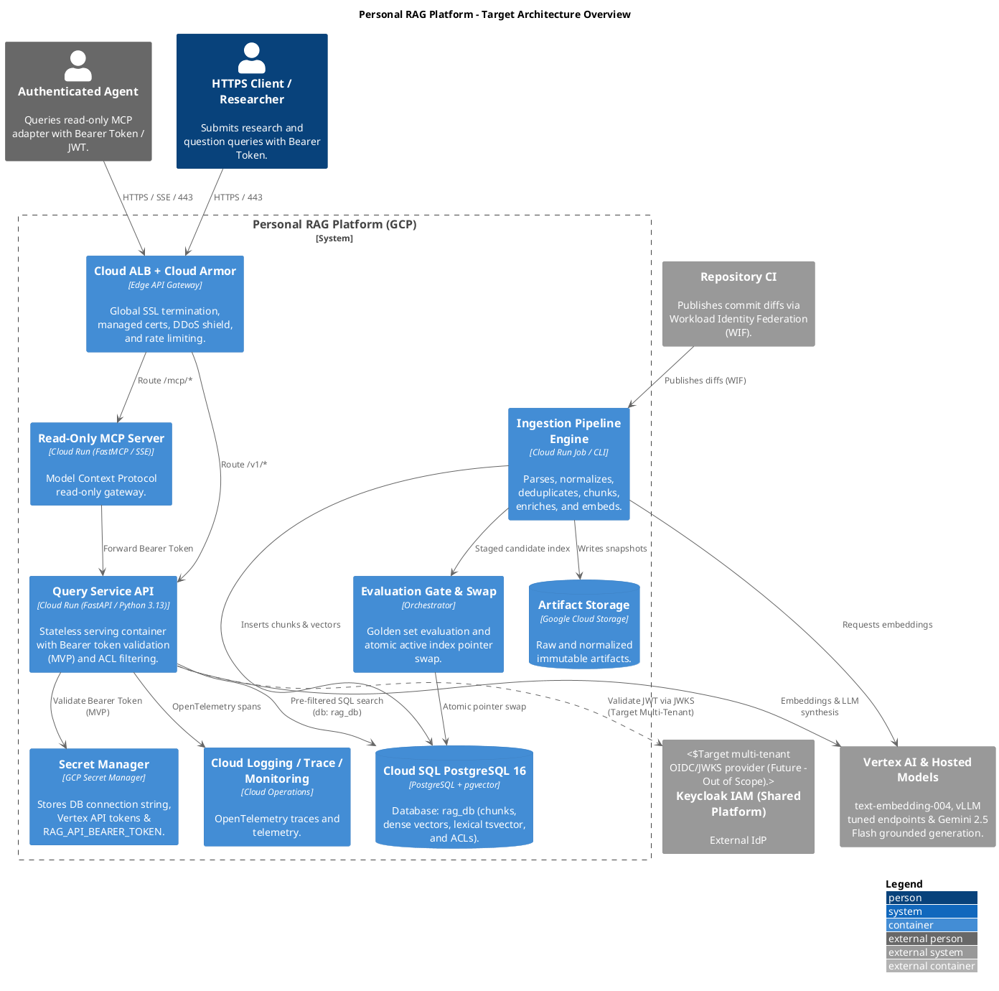
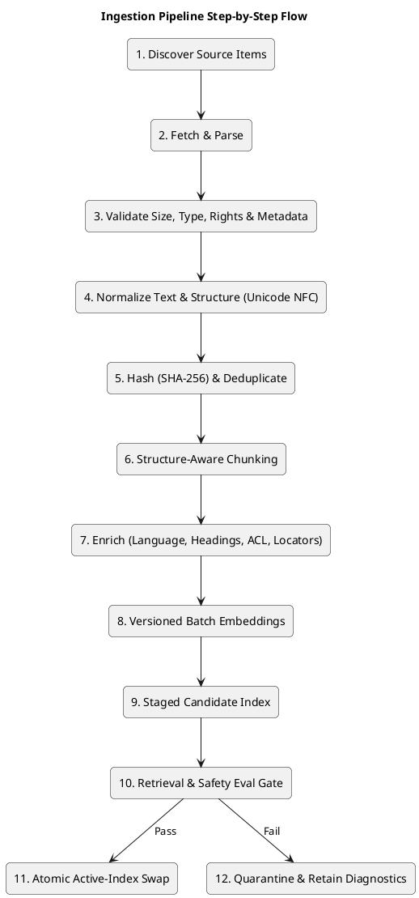

# Personal RAG platform specification

Status: proposed

Owner: `tt-agents-agentic-RAG`

Date: 2026-08-17

Progress tracking: last reviewed 2026-08-17. This document is the implementation plan and
the progress register for the personal platform; statuses refer to the personal platform,
not merely to the existing GPC parts pilot.

## 1. Purpose

Build a private personal Retrieval-Augmented Generation (RAG) platform deployed on
Google Cloud Platform (GCP). It must combine books, web pages, the canonical `tt-root/info`
knowledge base and project repositories without coupling the query service to any one
source format.

The platform has two independent products:

1. An ingestion platform that turns source material into versioned retrieval artifacts.
2. A read-only query boundary that humans and agents can use to search evidence or ask
   grounded questions.

The existing GPC parts pilot remains a compatibility slice. Its `/v1/answers` contract and
parts-specific tests must continue to work while the generic document pipeline is added.
The generic `Document`/`Chunk` model must not be forced into the existing `Part` model.

## 1.1 Implementation plan

Work is delivered as vertical slices. Each slice must leave behind executable tests,
versioned artifacts and an evidence link before the next dependent slice starts.

| Phase | Scope | Exit condition | Depends on |
|---|---|---|---|
| 0. Contracts ✅ | Source descriptors, adapters, document versions, chunks, citations and ingestion runs | Contract schemas and in-process contract tests pass | None |
| 1. Local baseline ✅ | One Markdown file through normalize → chunk → index → search → cited answer | End-to-end local demo and negative-query tests pass | Phase 0 |
| 2. First sources | `tt-root/info`, one web page and Windows PDF/EPUB ingestion | Each source has provenance, idempotency and parser-failure tests | Phase 1 |
| 3. Durable index | Cloud Storage artifacts, Cloud SQL schema, `pgvector`, full-text search and active-index pointer | Candidate index rebuild, evaluation and rollback succeed | Phase 2 |
| 4. Query platform | Generic search/answer API, hybrid retrieval, grounding, abstention and source ACL filters | Authenticated API returns verifiable citations and blocks unauthorized evidence | Phase 3 |
| 5. Agent boundary | Read-only MCP adapter over the HTTPS API | Agent smoke test works without direct database access or mutation tools | Phase 4 |
| 6. Repository integration | `rag-index` CLI, `.ragignore` and GitHub reusable workflow | Changed files, deletion tombstones and Workload Identity Federation work in CI | Phase 4 |
| 7. Operations | Terraform, Cloud Run jobs, monitoring, cost, freshness and rollback runbooks | Deployment drill and index/service rollback are evidenced | Phases 3–6 |

## 1.2 Progress register

Status meanings: **Implemented** is working in the repository; **Partial** exists only in
the GPC pilot or as documentation; **Pending** is specified but not built; **Not covered**
is deliberately outside the first release.

| ID | Capability | Status | Current evidence | Next action / gap |
|---|---|---|---|---|
| P-00 | Existing GPC parts RAG vertical slice | Implemented | `src/gpc_rag/`, 11 tests, five-case evaluation | Preserve compatibility while adding generic modules |
| P-01 | Generic source adapter contract | Implemented | `src/personal_rag/sources/base.py`, `sources/filesystem.py`, contract tests | Add web, `git_tree` and `repository_ci` adapters against the same protocol |
| P-02 | Canonical document/chunk/citation schemas | Implemented | `src/personal_rag/models.py`, `data/personal/sources/*.yaml`, contract tests | Extend locators for page, chapter and line-range sources in Phase 2 |
| P-03 | In-process fake index for local development | Implemented | `src/personal_rag/index/memory.py`, `tests/personal_rag/test_memory_index.py` | Keep it as the reference behaviour the Cloud SQL index must match |
| P-04 | Windows PDF/EPUB folder ingestion | Partial | Text-only `FilesystemAdapter` with hashing, escape guard and parser errors | Add PDF/EPUB parsing, page/chapter locators and resumable manifests |
| P-05 | Web-page ingestion | Pending | CLI contract and SSRF requirements in Section 8.2 | Implement HTTPS/redirect/robots/size controls and main-content parsing |
| P-06 | `tt-root/info` Git-aware ingestion | Pending | Source boundary in Section 8.3 | Index Markdown/text/YAML with commit, path and heading provenance |
| P-07 | Repository CI/CD indexer | Pending | `rag-index` contract in Section 8.4 | Implement changed-file manifest, `.ragignore`, tombstones and retries |
| P-08 | Shared normalize/chunk/enrich pipeline | Partial | `src/personal_rag/pipeline/`, idempotency and tombstone tests | Add PDF/EPUB and code-aware chunking; stages and versioning are in place |
| P-09 | Cloud Storage raw/normalized artifacts | Partial | Existing GPC catalog bucket in `deployment/gcp/main.tf` | Generalize bucket layout and immutable source snapshots |
| P-10 | Cloud SQL PostgreSQL metadata/index | Pending | Architecture decision in Section 4 | Add schema, migrations, ACL columns and active-index pointer |
| P-11 | Dense embeddings for personal corpus | Partial | `Embedder` protocol and offline `HashingEmbedder` | Add the version-pinned Vertex embedder, batching and cost accounting |
| P-12 | Sparse + dense hybrid retrieval | Partial | BM25 plus cosine fused with RRF in `index/memory.py` | Reimplement over PostgreSQL full-text search and `pgvector` |
| P-13 | Reranking | Not covered | Only specified as conditional in Section 9 | Add after hybrid recall is measured; do not pre-optimize |
| P-14 | Generic `/v1/search` and `/v1/answer` API | Pending | Existing `/v1/answers` is GPC-specific | Add generic typed contracts without breaking GPC clients |
| P-15 | Grounding, citations and abstention | Partial | `query/grounding.py` validates chunk IDs; abstention tests pass | Add claim-level entailment and source-version staleness checks |
| P-16 | Source-level ACL filtering | Partial | `MemoryIndex.search` filters labels before lexical and dense ranking | Enforce the same filter in SQL so it survives the Cloud SQL rewrite |
| P-17 | Read-only MCP agent adapter | Pending | MCP tools specified in Section 9 | Implement adapter over HTTPS; expose no database or ingestion mutation |
| P-18 | CI authentication with Workload Identity Federation | Pending | GCP choice documented; no resource exists | Add restricted provider, service account and reusable workflow |
| P-19 | Personal GCP Terraform deployment | Partial | GPC Cloud Run deployment exists | Add Cloud SQL, jobs, bucket layout, IAM and environment separation |
| P-20 | Personal evaluation corpus and release gates | Pending | Existing five-case GPC evaluation only | Add source-balanced golden, negative, ACL and injection datasets |
| P-21 | Observability, freshness and cost telemetry | Partial | Structured GPC completion logs and SLO docs exist | Add metrics/traces, ingestion lag, embedding cost and dashboards |
| P-22 | Security and rights controls | Partial | Existing threat model; no generic connectors | Implement web SSRF controls, secret scanning, rights policy and redaction |
| P-23 | Rollback and candidate-index activation | Partial | Candidate runs, atomic activation and `rollback()` with tests | Drill the same transaction against Cloud SQL and Cloud Storage |
| P-24 | OCR, audio, video, image and graph RAG | Not covered | Explicit first-release non-goals | Reconsider only after text corpus quality is measured |

The first implementation checkpoint, **P-01 through P-03**, is complete. Phases 0 and 1 are
delivered: contracts and protocols in `src/personal_rag/{models,errors}.py`,
`sources/base.py` and `index/base.py`; the local baseline in `pipeline/`, `index/memory.py`
and `query/`. Evidence is 55 tests under `tests/personal_rag/` plus `make demo`, which
takes a Markdown file from disk to a cited answer and fails if an unsupported question is
answered instead of refused.

Phase 1 runs with no GCP resources and no model provider. `HashingEmbedder` and
`DeterministicAnswerGenerator` stand in behind the protocols their Vertex counterparts will
implement, which is what keeps the release gate hermetic. Two calibration values —
`MemoryIndex.dense_floor` and `QueryService.min_retrieval_score` — were derived from the
hashing embedder's score distribution and must be re-derived in Phase 3, because a trained
embedding model has a completely different baseline similarity.

One deliberate divergence from section 7: the 400-800 token range is enforced as a ceiling
rather than a floor. Heading sections are never merged, so a document of short sections
produces chunks below the target (54-166 tokens in the sample corpus). Merging siblings to
reach a token count would give a chunk an ambiguous `heading_path` and a citation spanning
two topics. Section 7 already asks for this number to be tuned against retrieval recall, so
P-20 should decide it with measurements rather than the register asserting it now.

Phase 2 is next: the web and `git_tree` adapters (P-05, P-06) and PDF/EPUB parsing (P-04),
all against the now-fixed `SourceAdapter` protocol.

## 2. Goals and non-goals

### Goals

- Ingest local Windows folders containing ebooks through a Python command-line interface.
- Ingest individual web pages and later support a controlled set of web discovery jobs.
- Ingest `D:\src\tt-root.git\info` as a read-only, Git-aware source.
- Let project repositories publish changed files to the index during Continuous
  Integration and Continuous Delivery (CI/CD).
- Preserve source provenance down to page, heading, URL, repository commit/path and line
  range where available.
- Enforce source-level access control before retrieval, not in the prompt.
- Support both direct HTTPS clients and a read-only Model Context Protocol (MCP) adapter
  for agents.
- Make ingestion idempotent, incremental, observable and rollbackable.
- Evaluate retrieval and generation separately, with a release gate for each.

### Non-goals for the first release

- No agent-controlled ingestion, deletion or source permission changes.
- No autonomous web crawling across arbitrary domains.
- No browser automation for JavaScript-heavy pages; add it only as a separately approved
  connector.
- No Optical Character Recognition (OCR), audio, video or image understanding in the first
  slice.
- No multi-user tenancy beyond a single owner and explicit source visibility labels.
- No graph database or agentic retrieval loop until ordinary hybrid retrieval is measured.

## 3. Design principles

| Principle | Consequence |
|---|---|
| Sources are adapters, not query-time special cases | Every source emits the same canonical document and chunk records |
| Raw inputs are immutable | Re-ingestion creates a new document version; it never silently edits history |
| Retrieval is policy-aware | The authenticated principal and source filters are applied before ranking |
| Evidence is untrusted data | Retrieved text is never treated as instructions or authorization |
| Indexes are rebuildable artifacts | A candidate index is evaluated before the active pointer changes |
| Changes are evidence | Every run records source revision, parser, chunker, embedding and index versions |
| Read and write boundaries are separate | Query agents cannot trigger ingestion or mutate the corpus |
| Start with the smallest operational surface | Cloud SQL plus `pgvector` is the first index; a managed vector service is an upgrade decision |

## 4. Target architecture



### GCP component choices

| Component | First implementation | Reason | Upgrade trigger |
|---|---|---|---|
| Edge API Gateway | Global External Application Load Balancer + Cloud Armor | Automated Google SSL, DDoS mitigation, rate limiting (120 rpm), and unified path routing | Sustained multi-region traffic requirements |
| Authentication & Access Control | **MVP**: Pre-shared Bearer Token in Secret Manager<br/>**Target**: External Shared Keycloak IAM (Decoupled) | Streamlined single-user MVP with zero extra infrastructure; standard OAuth2 Resource Server for future multi-tenancy | Multi-user onboarding or shared agent mesh |
| Query API | Private Cloud Run service | Stateless HTTPS service with scale-to-zero and existing FastAPI base | Sustained latency or concurrency requires a different serving tier |
| Read-Only MCP Server | Cloud Run service (FastMCP / SSE) | Low-latency streaming tool gateway for autonomous AI agents | Large-scale multi-tenant agent fleets |
| Batch ingestion | Cloud Run Jobs | Source ingestion, parsing and indexing are run-to-completion workloads | Very large fan-out requires a dedicated data-processing system |
| Raw and normalized artifacts | Versioned Cloud Storage bucket | Cheap immutable storage and reproducible reprocessing | Retention, legal hold or data-lake requirements change |
| Metadata and index | Cloud SQL for PostgreSQL with `pgvector` and PostgreSQL full-text search | One transactional store for chunks, metadata, access filters, sparse search and vectors | Corpus size, recall or latency justifies a separate managed vector index |
| Embeddings | Vertex AI text embedding model, version-pinned in configuration | Centralized GCP identity and a multilingual/code-capable embedding path | Measured quality or cost requires a second embedding provider |
| Generation | Vertex AI Gemini & vLLM Hosted Models | Domain fine-tuned LoRA models + Gemini 2.5 Flash for frontier multi-hop reasoning | Cost, latency or quality evaluation justifies routing |
| CI authentication | Workload Identity Federation | No long-lived service-account keys in project repositories | None for the first release |
| Ingestion coordination | Direct job trigger first; Pub/Sub eventing later | Avoid a queue before incremental volume requires it | Multiple concurrent sources or sustained backlog |

Cloud Run provides services for HTTP requests and jobs for work that runs to completion;
Cloud SQL supports storing and querying vector embeddings with the `pgvector` extension;
Vertex AI provides text embedding models; and Google documents Workload Identity
Federation for deployment pipelines. Verify quotas, regional availability and pricing when
the implementation project is created. References: [Cloud Run overview](https://cloud.google.com/run/docs/overview/what-is-cloud-run),
[Cloud SQL generative AI overview](https://cloud.google.com/sql/docs/postgres/ai-overview),
[Vertex AI text embeddings](https://cloud.google.com/vertex-ai/generative-ai/docs/embeddings/get-text-embeddings),
[Workload Identity Federation for deployment pipelines](https://cloud.google.com/iam/docs/workload-identity-federation-with-deployment-pipelines).

## 5. Source abstraction

All connectors implement one contract. They must not know whether the final index is
PostgreSQL, a vector service or an in-process test double.

```python
class SourceAdapter(Protocol):
    source_type: str

    def discover(self, request: DiscoveryRequest) -> Iterable[SourceItem]: ...

    def fetch(self, item: SourceItem) -> RawDocument: ...

    def fingerprint(self, document: RawDocument) -> str: ...
```

The production pipeline owns normalization, chunking, metadata validation, embeddings and
index writes. An adapter owns only discovery and source-specific fetching/parsing.

### Source descriptor

```yaml
source_id: tt-root-info
source_type: git_tree
display_name: tt-root canonical information
visibility: private
owner: tomasz
refresh_policy: on_commit
root: D:\src\tt-root.git\info
include:
  - "**/*.md"
  - "**/*.txt"
  - "**/*.yaml"
rights_policy: personal_reference
```

Required source fields:

| Field | Meaning |
|---|---|
| `source_id` | Stable namespace used in citations, ACLs and ingestion runs |
| `source_type` | Adapter type, for example `filesystem`, `web`, `git_tree` or `repository_ci` |
| `visibility` | `private`, `shared` or `public`; default is `private` |
| `refresh_policy` | Manual, scheduled, on commit or event driven |
| `rights_policy` | Whether storage and model processing are permitted |
| `configuration` | Adapter-specific settings validated against a schema |
| `adapter_version` | Version that produced the source snapshot |

## 6. Canonical data model

### Document version

Each fetched source item becomes a versioned document. The identifier is stable across
content changes; `content_hash` identifies a specific version.

```text
DocumentVersion
  document_id           stable source-scoped identifier
  source_id              source namespace
  source_uri             file path, URL or repository URI
  title                  display title
  media_type             MIME type
  language               detected or configured language
  content_hash           hash of normalized content
  source_revision        file hash, Git commit or web validators
  fetched_at             UTC timestamp
  published_at           source timestamp when available
  parser_version         parser implementation
  metadata_json          source-specific metadata
  visibility             private/shared/public
  rights_policy          storage and processing policy
  status                 active, deleted, quarantined or rejected
```

### Chunk

```text
Chunk
  chunk_id               stable document-version plus ordinal identifier
  document_id
  document_version_hash
  ordinal
  text
  token_count
  heading_path           Markdown/HTML heading ancestry
  locator_json           page, paragraph, line range, URL fragment or Git path
  language
  acl_labels
  embedding_model
  embedding_dimensions
  chunker_version
  lexical_text_vector
  dense_embedding
  index_run_id
```

The citation returned to an agent must be able to reconstruct a human-verifiable locator:

- ebook: title, file identity, page or chapter when the parser provides it;
- web: canonical URL, fetched timestamp and heading or fragment;
- `tt-root/info`: repository commit, relative path and heading;
- repository: repository identity, commit SHA, path and line range where available.

## 7. Ingestion pipeline



### Idempotency and deletes

- A repeated fetch with the same normalized `content_hash` creates no new chunks or
  embeddings.
- A changed document creates a new version and tombstones the previous active version
  after the new version is indexed.
- `--delete-missing` is never the default for local or CI sources. It requires an explicit
  source snapshot and a dry-run summary.
- A failed ingestion run cannot change the active index.
- A source adapter may report `deleted`, `unreadable`, `unsupported` or `quarantined`; the
  pipeline must not interpret an adapter error as deletion.

### Chunking defaults

- Markdown and HTML: split by headings, then paragraphs, then sentences.
- Code: split by file and symbol/function boundaries, retaining imports and path metadata.
- PDF: preserve page boundaries and headings when available.
- EPUB: preserve book, chapter and section hierarchy.
- Initial target: approximately 400–800 tokens with 10–15% overlap, then tune using
  retrieval recall and context sufficiency rather than adopting the number blindly.
- Tables and code must not be flattened into prose without retaining their structure.

## 8. Source implementations

### 8.1 Windows ebook folder

First command-line interface:

```powershell
python -m personal_rag.ingest.filesystem `
  --path 'D:\Books' `
  --source-id ebooks `
  --include '*.pdf' --include '*.epub' `
  --manifest '.rag\ebooks-manifest.json' `
  --dry-run
```

The command must:

- walk the folder without following junctions outside the requested root;
- support PDF and EPUB first; reject unsupported formats explicitly;
- extract text locally and report per-file parse errors;
- preserve file hash, relative path, size, modification time and page/chapter locators;
- never upload a file until the user confirms the source configuration and rights policy;
- emit a resumable manifest so a large folder can be uploaded in batches;
- support `--changed-only`, `--delete-missing` and `--dry-run` with safe defaults;
- avoid logging book text or full local paths when the path is sensitive.

The first implementation may use local parsing and upload normalized documents/chunks. It
must retain the original file hash and parser version so a later parser can reprocess the
source deliberately.

### 8.2 Web page

First command-line interface:

```powershell
python -m personal_rag.ingest.web `
  --url 'https://example.com/article' `
  --source-id web-example-article `
  --dry-run
```

The adapter must:

- allow HTTPS only by default and validate every redirect;
- reject localhost, private-network, link-local and metadata-service destinations;
- enforce host allowlists, response-size limits, content-type limits and timeouts;
- honor `robots.txt` and record the policy decision;
- normalize canonical URLs and retain `ETag`/`Last-Modified` when available;
- extract the main article content while preserving title, headings, links and dates;
- record `fetched_at`, canonical URL, source URL and content hash;
- treat page content as untrusted data, including visible instructions and hidden text;
- make JavaScript rendering a separate opt-in adapter with a separate risk budget.

### 8.3 `tt-root/info`

The `info` adapter reads, but never edits, `D:\src\tt-root.git\info`.

Rules:

- source ID: `tt-root-info`;
- default revision: current Git commit, recorded in every document version;
- include maintained Markdown, categorized source notes, text and YAML where useful;
- exclude `.git`, generated rollups and unrelated `atlas/`, `learning/` or `compass/`
  content unless a separate source is configured;
- capture the level-one heading, heading path, relative path and Git commit;
- preserve Polish legacy material as source language metadata; do not silently translate
  or rewrite it during ingestion;
- treat `info/SCHEMA.md` as source governance, not as content instructions;
- make a source snapshot available for reproducible rebuilds.

The canonical source boundary is deliberate: `tt-root/info` answers “what is it?”, while
the RAG index supplies retrieval. Personal scores and interview activity remain outside
this source unless explicitly configured as another private source.

### 8.4 Repository CI/CD indexer

The repository integration is a portable `rag-index` command plus a reusable CI workflow,
not an agent with repository write access.

Example invocation:

```powershell
rag-index publish `
  --source-id "repo:$env:GITHUB_REPOSITORY" `
  --root . `
  --commit $env:GITHUB_SHA `
  --changed-only `
  --endpoint $env:RAG_INGEST_ENDPOINT
```

Default behavior:

- index only changed, supported files from the commit or merge base;
- include documentation and code through language-aware chunkers;
- exclude `.git`, dependency directories, build output, caches, binaries and secret-like
  filenames;
- honor an optional `.ragignore` and fail closed if it contains invalid patterns;
- send repository identity, commit SHA, branch/ref, path, language and line locators;
- upload through an authenticated ingestion endpoint or signed manifest, never a database
  credential;
- retry safely by manifest/content hash and report an ingestion run URL in CI;
- publish deletion tombstones only when the changed-file manifest proves the deletion;
- run asynchronously so an index outage does not block ordinary builds by default;
- provide a strict mode for documentation repositories where indexing is part of the
  release gate.

The first CI provider is GitHub Actions. The CLI remains provider-neutral so Bitbucket or
another CI system can call the same contract. CI authentication uses Workload Identity
Federation restricted by repository, organization, environment and ref; no JSON service
account keys are stored in project repositories.

## 9. Query and agent boundary

### HTTPS API

Add generic endpoints without breaking the GPC contract:

```text
POST /v1/search
POST /v1/answer
GET  /v1/sources
GET  /v1/ingestion-runs/{run_id}
```

`/v1/search` returns ranked chunks and provenance. `/v1/answer` performs bounded
generation over the selected evidence and returns citations. `/v1/sources` exposes only
source metadata the principal is allowed to see. Ingestion status is read-only from the
query identity.

Example search request:

```json
{
  "query": "How do I design a retrieval evaluation gate?",
  "source_ids": ["tt-root-info", "ebooks"],
  "top_k": 8,
  "request_id": "req-2026-08-17-001"
}
```

The server derives the principal from the authenticated identity. `source_ids` narrows
the search; it never grants access.

### MCP adapter

Expose a read-only MCP server for agents with these tools:

| Tool | Purpose | Mutations |
|---|---|---|
| `rag_search` | Return ranked evidence chunks and citations | None |
| `rag_answer` | Return a grounded answer over retrieved evidence | None |
| `rag_sources` | List visible source names and freshness | None |
| `rag_ingestion_status` | Inspect a run the caller is authorized to see | None |

The MCP adapter calls the HTTPS API; it does not connect to Cloud SQL directly. The host
and client identity are logged, but prompts and document bodies are not copied into
ordinary logs. No tool for ingestion, deletion, ACL changes or arbitrary URL fetching is
exposed in the first release.

### Query pipeline

1. Authenticate the caller and resolve source permissions.
2. Normalize the query and apply explicit source/type/time filters.
3. Run sparse full-text and dense vector retrieval in parallel.
4. Fuse rankings with Reciprocal Rank Fusion (RRF).
5. Rerank a bounded candidate set when evaluation proves the cost worthwhile.
6. Assemble a context budget with deduplication and source diversity limits.
7. Generate only from the context with an explicit abstention instruction.
8. Validate citation identifiers against retrieved chunks.
9. Return answer, evidence, versions, latency and degraded/fallback status.

## 10. Security, privacy and rights

| Risk | Required control |
|---|---|
| Private source leakage | Source ACL labels are filtered in SQL before sparse/dense ranking |
| Agent overreach | Query-only MCP/API identity; ingestion uses a separate identity |
| Prompt injection | Retrieved text is delimited untrusted data; it cannot issue tools or policies |
| Repository secrets | CI ignore rules, filename/content scanners and no raw secret logging |
| Web server-side request forgery | HTTPS, DNS/IP validation, redirect validation, host allowlist and size/time limits |
| Copyright or license violation | Source rights policy required before upload; do not expose full book/web text by default |
| Sensitive telemetry | Log IDs, versions, counts and hashes; redact query and chunk text by default |
| Rollback failure | Immutable source versions and candidate/active index pointers |
| Credential leakage | Workload Identity Federation and Secret Manager; no static service-account keys |

For ebooks and web pages, the owner must explicitly approve storage and model processing.
The RAG is a private research tool, not a redistribution service. Citation snippets should
be limited to what is needed to verify an answer.

## 11. Evaluation and release gates

The corpus needs a source-balanced golden set before production deployment:

| Slice | Minimum first target |
|---|---:|
| Ebooks | 10 questions across at least 3 books |
| Web | 10 questions across at least 3 domains/pages |
| `tt-root/info` | 10 questions across canonical AI, architecture and operations articles |
| Repositories | 10 questions requiring path/commit/code evidence |
| Negative and adversarial | 10 unsupported, stale, permission and injection cases |

Measure separately:

- retrieval recall@k, precision@k, Mean Reciprocal Rank (MRR) and source-filter accuracy;
- citation precision and citation recall;
- groundedness/entailment, abstention precision and unsupported-answer rate;
- freshness lag and deletion propagation time;
- ingestion idempotency and parse failure rate;
- p50/p95 latency, embedding cost per document, generation cost per answer and cache hit
  rate;
- ACL leakage rate, prompt-injection success rate and secret-detection false negatives.

Release gates:

1. No known ACL leakage or secret exposure.
2. Zero unsupported answers in the negative/adversarial set.
3. Retrieval and citation thresholds agreed per source slice, not one blended score.
4. Candidate index passes evaluation before activation.
5. Rollback restores the previous active index and service revision.
6. Every release records source snapshot, parser/chunker versions, embedding model,
   prompt version and evaluation report.

## 12. Repository layout proposal

A tick marks what exists after Phases 0 and 1; the rest is the target shape.

```text
src/personal_rag/
  models.py            ✅ canonical contracts (sections 5, 6 and 9)
  errors.py            ✅ typed ingestion and query failures
  sources/
    base.py            ✅ SourceAdapter protocol and descriptor loading
    filesystem.py      ✅ text formats; PDF/EPUB in Phase 2
    web.py
    git_tree.py
    repository_ci.py
  pipeline/
    normalize.py       ✅
    chunk.py           ✅ Markdown headings, code and tables
    enrich.py          ✅
    embed.py           ✅ Embedder protocol and offline HashingEmbedder
    publish.py         ✅ run orchestration, idempotency, tombstones
  index/
    base.py            ✅ DocumentIndex protocol
    memory.py          ✅ in-process hybrid index with candidate/active runs
    repository.py
    hybrid_search.py
    migrations/
  query/
    service.py         ✅ search, evidence budget, bounded generation
    grounding.py       ✅ citation validation
  api/
    http.py
    mcp.py
scripts/
  personal_rag_demo.py ✅ Phase 1 end-to-end check
  ingest_filesystem.py
  ingest_web.py
  ingest_tt_root_info.py
  rag_index.py
data/personal/
  sources/*.yaml       ✅ descriptor manifests
  notes/*.md           ✅ Phase 1 sample corpus
evals/
  datasets/
  reports/
docs/
  personal-rag-spec.md
  personal-rag-adr-*.md
deployment/gcp/
  main.tf
  sql.tf
  jobs.tf
  iam.tf
```

The existing GPC-specific modules can remain under `src/gpc_rag/` during migration. The
generic implementation should first be introduced behind interfaces and tested with an
in-process index before changing deployment resources.

## 13. Delivery plan

| Phase | Deliverable | Exit evidence |
|---|---|---|
| 0. Contract | Source, document, chunk, citation and ingestion-run schemas | Contract tests and example manifests |
| 1. Local pipeline | Filesystem, web and `tt-root/info` adapters with an in-process index | Idempotency, parsing, locator and negative-query tests |
| 2. GCP persistence | Cloud Storage artifacts, Cloud SQL schema, embedding job and candidate/active index | Terraform plan, migration test, rebuild and rollback test |
| 3. Query service | Hybrid search, grounded answers, source filters and citations | Source-balanced retrieval/generation evaluation |
| 4. Agent access | Private HTTPS plus read-only MCP adapter | Authenticated agent smoke test and ACL tests |
| 5. CI integration | Portable `rag-index` CLI and GitHub reusable workflow | Changed-file indexing, deletion tombstone and WIF test |
| 6. Operations | Monitoring, cost dashboard, freshness and failed-ingestion alerts | Runbook drill and rollback evidence |

## 14. Decisions to confirm before implementation

Defaults are proposed so implementation can proceed without redesign:

| Decision | Proposed default |
|---|---|
| GCP project | Dedicated personal RAG project, separate from shared `tt-cloud-infra` foundations |
| Region | `europe-west1`, matching the existing pilot unless data residency or service availability requires another region |
| Initial index | Cloud SQL for PostgreSQL plus `pgvector` and PostgreSQL full-text search |
| Generation | Vertex AI Gemini through the existing generator boundary |
| First ebook formats | PDF and EPUB; MOBI/scan/OCR later |
| Web policy | Explicit URL and host allowlist; no crawler or JavaScript rendering initially |
| Agent protocol | HTTPS API as the contract, read-only MCP as the agent adapter |
| CI provider | GitHub Actions first; provider-neutral CLI for other repositories |
| Indexing mode | Changed-file incremental indexing with explicit full-rebuild command |
| ACL model | Single owner initially, source labels designed for future principals |
| Raw content | Store immutable normalized text and provenance; retain original binaries only when rights and retention policy permit |

## 15. Evidence and references

The design is grounded in:

- the existing GPC vertical slice: `docs/architecture.md`, `docs/threat-model.md`,
  `docs/rag-problem-evidence.md`;
- the canonical RAG reference: `D:\src\tt-root.git\info\knowledge-base\part-3-ai-engineering\12-rag-pipelines.md`;
- the AI lifecycle and artifact model: `D:\src\tt-root.git\info\ai\architecture\AI-System-Lifecycle-and-Artifacts.md`;
- the `tt-root/info` governance contract: `D:\src\tt-root.git\info\SCHEMA.md`;
- the repository inventory and ownership boundary: `D:\src\tt-root.git\compass\REPOS.md`.

The first implementation should create an Architecture Decision Record (ADR) for the
Cloud SQL/`pgvector` choice and another for the MCP/API boundary before deployment code is
expanded.
